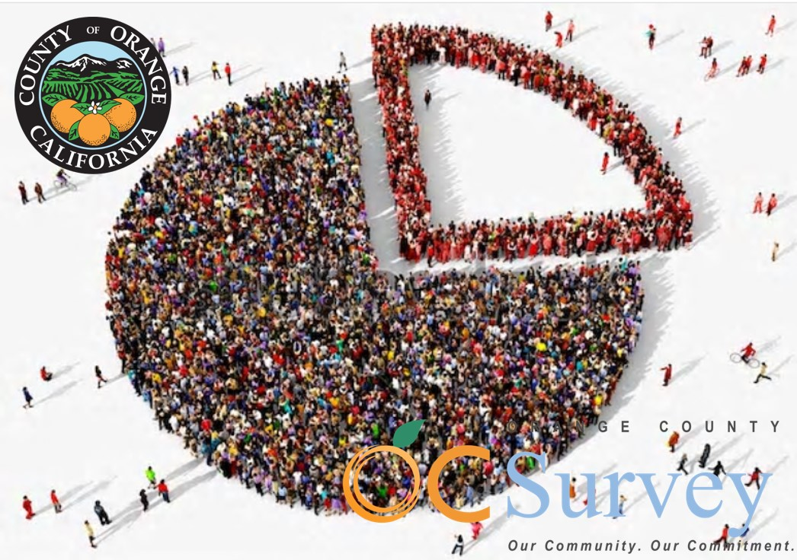

# Orange County Geodemographics 2016 ACS 5-Year Data Documentation

*Orange County American Community Survey (ACS) Geodemographic Repository   Dr. Kostas Alexandridis, GISP. OC Public Works Geospatial Services* Version: 2026.1, Date: February 2026

[◀️ Back to ReadMe](../README.md)

## Geodemographic Tables by Group 

For each of the geographies described in the previous section, four categories of geodemographic characteristics are available:

- [**Demographic Characteristics (8 sections, 140 variables)**](#demographic)
- [**Economic Characteristics (21 sections, 641 variables)**](#economic)
- [**Housing Characteristics (26 sections, 448 variables)**](#housing)
- [**Social Characteristics (23 sections, 676 variables)**](#social)

Each of the geographies is represented by a separate geodatabase structure. Within of each of the geographic level geodatabases, each of the four characteristics is represented by a _feature class_ respectively. In order to easily identify each of the sub-groups within each category, the name of the original census table field was adjusted by prepending to it the subgroup identification code. For example, the original field B01001e1 would become D01_B01001e1 in the new feature class for the demographic characteristics.

More detailed description of each sub-group within each of the four feature classes representing the ACS table characteristics is provided below. The table's columns represent: the subgroup's code; its descriptive name;the universe (summative) level of the reference; the ACS Census table in which the original fields are located; the fields/variables of the data, and; how many fields are included in the subgroup.

---

## 📚 Demographic Characteristics (8 sections, 140 variables) 

The demographic characteristics selected for spatial representation can be found in ACS data tables X1-X5. They are divided in 8 subgroups: total population, sex and age, median age by sex and race, race, race alone or in combination with other races, hispanic or latino, and citizen voting age population.

Code | Name | Variable Count |
| --- | --- | --- |
| [D01](#d01) | Total Population | 1 |
| [D02](#d02) | Sex and Age | 49 |
| [D03](#d03) | Median Age by Sex and Race | 12 |
| [D04](#d04) | Race | 10 |
| [D05](#d05) | Race Alone or in Combination with Other Races | 6 |
| [D06](#d06) | Hispanic or Latino | 21 |
| [D07](#d07) | Hispanic or Latino by Origin | 31 |
| [D08](#d08) | Citizen Voting Age Population | 10 |

[🔙 Back to Tables](#tables)

### 🏷️ D01: Total Population (1 variables) 

> 🆔 B01003_001E: Total Population; 

[🔙 Back to Sections](#demographic)

### 🏷️ D02: Sex and Age (49 variables) 

> 🆔 B01001_001E: Total Population (Sex and Age); 
🆔 B01001_002E: Male; 
🆔 B01001_003E: Male: Under 5 years; 
🆔 B01001_004E: Male: 5 to 9 years; 
🆔 B01001_005E: Male: 10 to 14 years; 
🆔 B01001_006E: Male: 15 to 17 years; 
🆔 B01001_007E: Male: 18 and 19 years; 
🆔 B01001_008E: Male: 20 years; 
🆔 B01001_009E: Male: 21 years; 
🆔 B01001_010E: Male: 22 to 24 years; 
🆔 B01001_011E: Male: 25 to 29 years; 
🆔 B01001_012E: Male: 30 to 34 years; 
🆔 B01001_013E: Male: 35 to 39 years; 
🆔 B01001_014E: Male: 40 to 44 years; 
🆔 B01001_015E: Male: 45 to 49 years; 
🆔 B01001_016E: Male: 50 to 54 years; 
🆔 B01001_017E: Male: 55 to 59 years; 
🆔 B01001_018E: Male: 60 and 61 years; 
🆔 B01001_019E: Male: 62 to 64 years; 
🆔 B01001_020E: Male: 65 and 66 years; 
🆔 B01001_021E: Male: 67 to 69 years; 
🆔 B01001_022E: Male: 70 to 74 years; 
🆔 B01001_023E: Male: 75 to 79 years; 
🆔 B01001_024E: Male: 80 to 84 years; 
🆔 B01001_025E: Male: 85 years and over; 
🆔 B01001_026E: Female; 
🆔 B01001_027E: Female: Under 5 years; 
🆔 B01001_028E: Female: 5 to 9 years; 
🆔 B01001_029E: Female: 10 to 14 years; 
🆔 B01001_030E: Female: 15 to 17 years; 
🆔 B01001_031E: Female: 18 and 19 years; 
🆔 B01001_032E: Female: 20 years; 
🆔 B01001_033E: Female: 21 years; 
🆔 B01001_034E: Female: 22 to 24 years; 
🆔 B01001_035E: Female: 25 to 29 years; 
🆔 B01001_036E: Female: 30 to 34 years; 
🆔 B01001_037E: Female: 35 to 39 years; 
🆔 B01001_038E: Female: 40 to 44 years; 
🆔 B01001_039E: Female: 45 to 49 years; 
🆔 B01001_040E: Female: 50 to 54 years; 
🆔 B01001_041E: Female: 55 to 59 years; 
🆔 B01001_042E: Female: 60 and 61 years; 
🆔 B01001_043E: Female: 62 to 64 years; 
🆔 B01001_044E: Female: 65 and 66 years; 
🆔 B01001_045E: Female: 67 to 69 years; 
🆔 B01001_046E: Female: 70 to 74 years; 
🆔 B01001_047E: Female: 75 to 79 years; 
🆔 B01001_048E: Female: 80 to 84 years; 
🆔 B01001_049E: Female: 85 years and over; 

[🔙 Back to Sections](#demographic)

### 🏷️ D03: Median Age by Sex and Race (12 variables) 

> 🆔 B01002A_001E: Median age: White alone; 
🆔 B01002B_001E: Median age: Black or African American alone; 
🆔 B01002C_001E: Median age: American Indian and Alaska Native alone; 
🆔 B01002D_001E: Median age: Asian alone; 
🆔 B01002E_001E: Median age: Native Hawaiian and Other Pacific Islander alone; 
🆔 B01002F_001E: Median age: Some Other Race alone; 
🆔 B01002G_001E: Median age: Two or More Races; 
🆔 B01002H_001E: Median age: White alone, not Hispanic or Latino; 
🆔 B01002I_001E: Median age: Hispanic or Latino; 
🆔 B01002_001E: Total Population (Median Age); 
🆔 B01002_002E: Median age: Male; 
🆔 B01002_003E: Median age: Female; 

[🔙 Back to Sections](#demographic)

### 🏷️ D04: Race (10 variables) 

> 🆔 B02001_001E: Total Population (Race); 
🆔 B02001_002E: White alone; 
🆔 B02001_003E: Black or African American alone; 
🆔 B02001_004E: American Indian and Alaska Native alone; 
🆔 B02001_005E: Asian alone; 
🆔 B02001_006E: Native Hawaiian and Other Pacific Islander alone; 
🆔 B02001_007E: Some other race alone; 
🆔 B02001_008E: Two or more races; 
🆔 B02001_009E: Two or more races: Two races including Some other race; 
🆔 B02001_010E: Two or more races: Two races excluding Some other race and three or more races; 

[🔙 Back to Sections](#demographic)

### 🏷️ D05: Race Alone or in Combination with Other Races (6 variables) 

> 🆔 B02008_001E: White; 
🆔 B02009_001E: Black or African American; 
🆔 B02010_001E: American Indian and Alaska Native; 
🆔 B02011_001E: Asian; 
🆔 B02012_001E: Native Hawaiian and Other Pacific Islander; 
🆔 B02013_001E: Some Other Race; 

[🔙 Back to Sections](#demographic)

### 🏷️ D06: Hispanic or Latino (21 variables) 

> 🆔 B03002_003E: Not Hispanic or Latino: White alone; 
🆔 B03002_004E: Not Hispanic or Latino: Black or African American alone; 
🆔 B03002_005E: Not Hispanic or Latino: American Indian and Alaska Native alone; 
🆔 B03002_006E: Not Hispanic or Latino: Asian alone; 
🆔 B03002_007E: Not Hispanic or Latino: Native Hawaiian and Other Pacific Islander alone; 
🆔 B03002_008E: Not Hispanic or Latino: Some other race alone; 
🆔 B03002_009E: Not Hispanic or Latino: Two or more races; 
🆔 B03002_010E: Not Hispanic or Latino: Two or more races: Two races including Some other race; 
🆔 B03002_011E: Not Hispanic or Latino: Two or more races: Two races excluding Some other race and three or more races; 
🆔 B03002_013E: Hispanic or Latino: White alone; 
🆔 B03002_014E: Hispanic or Latino: Black or African American alone; 
🆔 B03002_015E: Hispanic or Latino: American Indian and Alaska Native alone; 
🆔 B03002_016E: Hispanic or Latino: Asian alone; 
🆔 B03002_017E: Hispanic or Latino: Native Hawaiian and Other Pacific Islander alone; 
🆔 B03002_018E: Hispanic or Latino: Some other race alone; 
🆔 B03002_019E: Hispanic or Latino: Two or more races; 
🆔 B03002_020E: Hispanic or Latino: Two or more races: Two races including Some other race; 
🆔 B03002_021E: Hispanic or Latino: Two or more races: Two races excluding Some other race and three or more races; 
🆔 B03003_001E: Total Population (Hispanic or Latino); 
🆔 B03003_002E: Not Hispanic or Latino; 
🆔 B03003_003E: Hispanic or Latino; 

[🔙 Back to Sections](#demographic)

### 🏷️ D07: Hispanic or Latino by Origin (31 variables) 

> 🆔 B03001_001E: Total Population (Hispanic or Latino by Origin); 
🆔 B03001_002E: Not Hispanic or Latino; 
🆔 B03001_003E: Hispanic or Latino; 
🆔 B03001_004E: Hispanic or Latino: Mexican; 
🆔 B03001_005E: Hispanic or Latino: Puerto Rican; 
🆔 B03001_006E: Hispanic or Latino: Cuban; 
🆔 B03001_007E: Hispanic or Latino: Dominican Dominican Republic; 
🆔 B03001_008E: Hispanic or Latino: Central American; 
🆔 B03001_009E: Hispanic or Latino: Central American: Costa Rican; 
🆔 B03001_010E: Hispanic or Latino: Central American: Guatemalan; 
🆔 B03001_011E: Hispanic or Latino: Central American: Honduran; 
🆔 B03001_012E: Hispanic or Latino: Central American: Nicaraguan; 
🆔 B03001_013E: Hispanic or Latino: Central American: Panamanian; 
🆔 B03001_014E: Hispanic or Latino: Central American: Salvadoran; 
🆔 B03001_015E: Hispanic or Latino: Central American: Other Central American; 
🆔 B03001_016E: Hispanic or Latino: South American; 
🆔 B03001_017E: Hispanic or Latino: South American: Argentinean; 
🆔 B03001_018E: Hispanic or Latino: South American: Bolivian; 
🆔 B03001_019E: Hispanic or Latino: South American: Chilean; 
🆔 B03001_020E: Hispanic or Latino: South American: Colombian; 
🆔 B03001_021E: Hispanic or Latino: South American: Ecuadorian; 
🆔 B03001_022E: Hispanic or Latino: South American: Paraguayan; 
🆔 B03001_023E: Hispanic or Latino: South American: Peruvian; 
🆔 B03001_024E: Hispanic or Latino: South American: Uruguayan; 
🆔 B03001_025E: Hispanic or Latino: South American: Venezuelan; 
🆔 B03001_026E: Hispanic or Latino: South American: Other South American; 
🆔 B03001_027E: Hispanic or Latino: Other Hispanic or Latino; 
🆔 B03001_028E: Hispanic or Latino: Other Hispanic or Latino: Spaniard; 
🆔 B03001_029E: Hispanic or Latino: Other Hispanic or Latino: Spanish; 
🆔 B03001_030E: Hispanic or Latino: Other Hispanic or Latino: Spanish American; 
🆔 B03001_031E: Hispanic or Latino: Other Hispanic or Latino: All other Hispanic or Latino; 

[🔙 Back to Sections](#demographic)

### 🏷️ D08: Citizen Voting Age Population (10 variables) 

> 🆔 B05003_008E: Male: 18 years and over; 
🆔 B05003_009E: Male: 18 years and over: Native; 
🆔 B05003_010E: Male: 18 years and over: Foreign born; 
🆔 B05003_011E: Male: 18 years and over: Foreign born: Naturalized US citizen; 
🆔 B05003_012E: Male: 18 years and over: Foreign born: Not a US citizen; 
🆔 B05003_019E: Female: 18 years and over; 
🆔 B05003_020E: Female: 18 years and over: Native; 
🆔 B05003_021E: Female: 18 years and over: Foreign born; 
🆔 B05003_022E: Female: 18 years and over: Foreign born: Naturalized US citizen; 
🆔 B05003_023E: Female: 18 years and over: Foreign born: Not a US citizen; 

[🔙 Back to Sections](#demographic)

## 📚 Economic Characteristics (21 sections, 641 variables) 

The demographic characteristics selected for spatial representation can be found in ACS data tables X1-X5. They are divided in 8 subgroups: total population, sex and age, median age by sex and race, race, race alone or in combination with other races, hispanic or latino, and citizen voting age population.

Code | Name | Variable Count |
| --- | --- | --- |
| [E01](#e01) | Employment Status | 7 |
| [E02](#e02) | Work Status by Age of Worker | 36 |
| [E03](#e03) | Occupation by Median Earnings | 23 |
| [E04](#e04) | Means of Transportation to Work | 10 |
| [E05](#e05) | Travel Time to Work | 14 |
| [E06](#e06) | Vehicles Available for Workers | 8 |
| [E07](#e07) | Vehicles Available by Sex of Workers | 16 |
| [E08](#e08) | Median Age by Means of Transportation to Work | 7 |
| [E09](#e09) | Means of Transportation to Work by Race | 63 |
| [E10](#e10) | Occupation | 73 |
| [E11](#e11) | Industry | 55 |
| [E12](#e12) | Class of Worker | 21 |
| [E13](#e13) | Household Income and Earnings in the Past 12 Months | 46 |
| [E14](#e14) | Income and Earnings in Dollars | 31 |
| [E15](#e15) | Family Income in Dollars | 17 |
| [E16](#e16) | Health Insurance Coverage by Age | 66 |
| [E17](#e17) | Ratio of Income to Poverty Level | 8 |
| [E18](#e18) | Poverty in Population in the Past 12 Months | 35 |
| [E19](#e19) | Poverty in Households in the Past 12 Months | 59 |
| [E20](#e20) | Poverty Status by Family | 41 |
| [E21](#e21) | Aggregate Income Deficit in Dollars for Families | 5 |

[🔙 Back to Tables](#tables)

### 🏷️ E01: Employment Status (7 variables) 

> 🆔 B23025_001E: Total Population, 16+ years; 
🆔 B23025_002E: In labor force; 
🆔 B23025_003E: In labor force: Civilian labor force; 
🆔 B23025_004E: In labor force: Civilian labor force: Employed; 
🆔 B23025_005E: In labor force: Civilian labor force: Unemployed; 
🆔 B23025_006E: In labor force: Armed Forces; 
🆔 B23025_007E: Not in labor force; 

[🔙 Back to Sections](#economic)

### 🏷️ E02: Work Status by Age of Worker (36 variables) 

> 🆔 B23027_001E: Total Population, 16+ years; 
🆔 B23027_002E: 16 to 19 years; 
🆔 B23027_003E: 16 to 19 years: Worked in the past 12 months; 
🆔 B23027_004E: 16 to 19 years: Worked in the past 12 months: Worked full-time year-round; 
🆔 B23027_005E: 16 to 19 years: Worked in the past 12 months: Worked less than full-time year-round; 
🆔 B23027_006E: 16 to 19 years: Did not work in the past 12 months; 
🆔 B23027_007E: 20 to 24 years; 
🆔 B23027_008E: 20 to 24 years: Worked in the past 12 months; 
🆔 B23027_009E: 20 to 24 years: Worked in the past 12 months: Worked full-time year-round; 
🆔 B23027_010E: 20 to 24 years: Worked in the past 12 months: Worked less than full-time year-round; 
🆔 B23027_011E: 20 to 24 years: Did not work in the past 12 months; 
🆔 B23027_012E: 25 to 44 years; 
🆔 B23027_013E: 25 to 44 years: Worked in the past 12 months; 
🆔 B23027_014E: 25 to 44 years: Worked in the past 12 months: Worked full-time year-round; 
🆔 B23027_015E: 25 to 44 years: Worked in the past 12 months: Worked less than full-time year-round; 
🆔 B23027_016E: 25 to 44 years: Did not work in the past 12 months; 
🆔 B23027_017E: 45 to 54 years; 
🆔 B23027_018E: 45 to 54 years: Worked in the past 12 months; 
🆔 B23027_019E: 45 to 54 years: Worked in the past 12 months: Worked full-time year-round; 
🆔 B23027_020E: 45 to 54 years: Worked in the past 12 months: Worked less than full-time year-round; 
🆔 B23027_021E: 45 to 54 years: Did not work in the past 12 months; 
🆔 B23027_022E: 55 to 64 years; 
🆔 B23027_023E: 55 to 64 years: Worked in the past 12 months; 
🆔 B23027_024E: 55 to 64 years: Worked in the past 12 months: Worked full-time year-round; 
🆔 B23027_025E: 55 to 64 years: Worked in the past 12 months: Worked less than full-time year-round; 
🆔 B23027_026E: 55 to 64 years: Did not work in the past 12 months; 
🆔 B23027_027E: 65 to 69 years; 
🆔 B23027_028E: 65 to 69 years: Worked in the past 12 months; 
🆔 B23027_029E: 65 to 69 years: Worked in the past 12 months: Worked full-time year-round; 
🆔 B23027_030E: 65 to 69 years: Worked in the past 12 months: Worked less than full-time year-round; 
🆔 B23027_031E: 65 to 69 years: Did not work in the past 12 months; 
🆔 B23027_032E: 70 years and over; 
🆔 B23027_033E: 70 years and over: Worked in the past 12 months; 
🆔 B23027_034E: 70 years and over: Worked in the past 12 months: Worked full-time year-round; 
🆔 B23027_035E: 70 years and over: Worked in the past 12 months: Worked less than full-time year-round; 
🆔 B23027_036E: 70 years and over: Did not work in the past 12 months; 

[🔙 Back to Sections](#economic)

### 🏷️ E03: Occupation by Median Earnings (23 variables) 

> 🆔 B24011_001E: Median Earnings: Civilian Employed Population, 16+ years; 
🆔 B24011_002E: Management business science and arts occupations; 
🆔 B24011_003E: Management business science and arts occupations: Management business and financial occupations; 
🆔 B24011_006E: Management business science and arts occupations: Computer engineering and science occupations; 
🆔 B24011_010E: Management business science and arts occupations: Education legal community service arts and media occupations; 
🆔 B24011_015E: Management business science and arts occupations: Healthcare practitioners and technical occupations; 
🆔 B24011_018E: Service occupations; 
🆔 B24011_019E: Service occupations: Healthcare support occupations; 
🆔 B24011_020E: Service occupations: Protective service occupations; 
🆔 B24011_023E: Service occupations: Food preparation and serving related occupations; 
🆔 B24011_024E: Service occupations: Building and grounds cleaning and maintenance occupations; 
🆔 B24011_025E: Service occupations: Personal care and service occupations; 
🆔 B24011_026E: Sales and office occupations; 
🆔 B24011_027E: Sales and office occupations: Sales and related occupations; 
🆔 B24011_028E: Sales and office occupations: Office and administrative support occupations; 
🆔 B24011_029E: Natural resources construction and maintenance occupations; 
🆔 B24011_030E: Natural resources construction and maintenance occupations: Farming fishing and forestry occupations; 
🆔 B24011_031E: Natural resources construction and maintenance occupations: Construction and extraction occupations; 
🆔 B24011_032E: Natural resources construction and maintenance occupations: Installation maintenance and repair occupations; 
🆔 B24011_033E: Production transportation and material moving occupations; 
🆔 B24011_034E: Production transportation and material moving occupations: Production occupations; 
🆔 B24011_035E: Production transportation and material moving occupations: Transportation occupations; 
🆔 B24011_036E: Production transportation and material moving occupations: Material moving occupations; 

[🔙 Back to Sections](#economic)

### 🏷️ E04: Means of Transportation to Work (10 variables) 

> 🆔 B08301_001E: Workers, 16+ years; 
🆔 B08301_002E: Car truck or van; 
🆔 B08301_003E: Car truck or van: Drove alone; 
🆔 B08301_004E: Car truck or van: Carpooled; 
🆔 B08301_016E: Taxicab; 
🆔 B08301_017E: Motorcycle; 
🆔 B08301_018E: Bicycle; 
🆔 B08301_019E: Walked; 
🆔 B08301_020E: Other means; 
🆔 B08301_021E: Worked at home; 

[🔙 Back to Sections](#economic)

### 🏷️ E05: Travel Time to Work (14 variables) 

> 🆔 B08012_001E: Total Workers 16+ years who did not work at home; 
🆔 B08012_002E: Less than 5 minutes; 
🆔 B08012_003E: 5 to 9 minutes; 
🆔 B08012_004E: 10 to 14 minutes; 
🆔 B08012_005E: 15 to 19 minutes; 
🆔 B08012_006E: 20 to 24 minutes; 
🆔 B08012_007E: 25 to 29 minutes; 
🆔 B08012_008E: 30 to 34 minutes; 
🆔 B08012_009E: 35 to 39 minutes; 
🆔 B08012_010E: 40 to 44 minutes; 
🆔 B08012_011E: 45 to 59 minutes; 
🆔 B08012_012E: 60 to 89 minutes; 
🆔 B08012_013E: 90 or more minutes; 
🆔 B08013_001E: Aggregate travel time to work in minutes; 

[🔙 Back to Sections](#economic)

### 🏷️ E06: Vehicles Available for Workers (8 variables) 

> 🆔 B08014_001E: Workers 16+ years in households; 
🆔 B08014_002E: No vehicle available; 
🆔 B08014_003E: 1 vehicle available; 
🆔 B08014_004E: 2 vehicles available; 
🆔 B08014_005E: 3 vehicles available; 
🆔 B08014_006E: 4 vehicles available; 
🆔 B08014_007E: 5 or more vehicles available; 
🆔 B08015_001E: Aggregate number of vehicles car truck or van used in commuting; 

[🔙 Back to Sections](#economic)

### 🏷️ E07: Vehicles Available by Sex of Workers (16 variables) 

> 🆔 B08014_008E: Male Workers; 
🆔 B08014_009E: Male: No vehicle available; 
🆔 B08014_010E: Male: 1 vehicle available; 
🆔 B08014_011E: Male: 2 vehicles available; 
🆔 B08014_012E: Male: 3 vehicles available; 
🆔 B08014_013E: Male: 4 vehicles available; 
🆔 B08014_014E: Male: 5 or more vehicles available; 
🆔 B08014_015E: Female Workers; 
🆔 B08014_016E: Female: No vehicle available; 
🆔 B08014_017E: Female: 1 vehicle available; 
🆔 B08014_018E: Female: 2 vehicles available; 
🆔 B08014_019E: Female: 3 vehicles available; 
🆔 B08014_020E: Female: 4 vehicles available; 
🆔 B08014_021E: Female: 5 or more vehicles available; 
🆔 B08015_002E: Aggregate number of vehicles car truck or van used in commuting: Male; 
🆔 B08015_003E: Aggregate number of vehicles car truck or van used in commuting: Female; 

[🔙 Back to Sections](#economic)

### 🏷️ E08: Median Age by Means of Transportation to Work (7 variables) 

> 🆔 B08103_001E: Median age: Workers, 16+ years; 
🆔 B08103_002E: Median age: Car truck or van-drove alone; 
🆔 B08103_003E: Median age: Car truck or van-carpooled; 
🆔 B08103_004E: Median age: Public transportation excluding taxicab; 
🆔 B08103_005E: Median age: Walked; 
🆔 B08103_006E: Median age: Taxicab motorcycle bicycle or other means; 
🆔 B08103_007E: Median age: Worked at home; 

[🔙 Back to Sections](#economic)

### 🏷️ E09: Means of Transportation to Work by Race (63 variables) 

> 🆔 B08105A_001E: White alone; 
🆔 B08105A_002E: Car truck or van-drove alone; 
🆔 B08105A_003E: Car truck or van-carpooled; 
🆔 B08105A_004E: Public transportation excluding taxicab; 
🆔 B08105A_005E: Walked; 
🆔 B08105A_006E: Taxicab motorcycle bicycle or other means; 
🆔 B08105A_007E: Worked at home; 
🆔 B08105B_001E: Black or African American alone; 
🆔 B08105B_002E: Car truck or van-drove alone; 
🆔 B08105B_003E: Car truck or van-carpooled; 
🆔 B08105B_004E: Public transportation excluding taxicab; 
🆔 B08105B_005E: Walked; 
🆔 B08105B_006E: Taxicab motorcycle bicycle or other means; 
🆔 B08105B_007E: Worked at home; 
🆔 B08105C_001E: American Indian and Alaska Native alone; 
🆔 B08105C_002E: Car truck or van-drove alone; 
🆔 B08105C_003E: Car truck or van-carpooled; 
🆔 B08105C_004E: Public transportation excluding taxicab; 
🆔 B08105C_005E: Walked; 
🆔 B08105C_006E: Taxicab motorcycle bicycle or other means; 
🆔 B08105C_007E: Worked at home; 
🆔 B08105D_001E: Asian alone; 
🆔 B08105D_002E: Car truck or van-drove alone; 
🆔 B08105D_003E: Car truck or van-carpooled; 
🆔 B08105D_004E: Public transportation excluding taxicab; 
🆔 B08105D_005E: Walked; 
🆔 B08105D_006E: Taxicab motorcycle bicycle or other means; 
🆔 B08105D_007E: Worked at home; 
🆔 B08105E_001E: Native Hawaiian and Other Pacific Islander alone; 
🆔 B08105E_002E: Car truck or van-drove alone; 
🆔 B08105E_003E: Car truck or van-carpooled; 
🆔 B08105E_004E: Public transportation excluding taxicab; 
🆔 B08105E_005E: Walked; 
🆔 B08105E_006E: Taxicab motorcycle bicycle or other means; 
🆔 B08105E_007E: Worked at home; 
🆔 B08105F_001E: Some Other Race alone; 
🆔 B08105F_002E: Car truck or van-drove alone; 
🆔 B08105F_003E: Car truck or van-carpooled; 
🆔 B08105F_004E: Public transportation excluding taxicab; 
🆔 B08105F_005E: Walked; 
🆔 B08105F_006E: Taxicab motorcycle bicycle or other means; 
🆔 B08105F_007E: Worked at home; 
🆔 B08105G_001E: Two or More Races; 
🆔 B08105G_002E: Car truck or van-drove alone; 
🆔 B08105G_003E: Car truck or van-carpooled; 
🆔 B08105G_004E: Public transportation excluding taxicab; 
🆔 B08105G_005E: Walked; 
🆔 B08105G_006E: Taxicab motorcycle bicycle or other means; 
🆔 B08105G_007E: Worked at home; 
🆔 B08105H_001E: White alone, not Hispanic or Latino; 
🆔 B08105H_002E: Car truck or van-drove alone; 
🆔 B08105H_003E: Car truck or van-carpooled; 
🆔 B08105H_004E: Public transportation excluding taxicab; 
🆔 B08105H_005E: Walked; 
🆔 B08105H_006E: Taxicab motorcycle bicycle or other means; 
🆔 B08105H_007E: Worked at home; 
🆔 B08105I_001E: Hispanic or Latino; 
🆔 B08105I_002E: Car truck or van-drove alone; 
🆔 B08105I_003E: Car truck or van-carpooled; 
🆔 B08105I_004E: Public transportation excluding taxicab; 
🆔 B08105I_005E: Walked; 
🆔 B08105I_006E: Taxicab motorcycle bicycle or other means; 
🆔 B08105I_007E: Worked at home; 

[🔙 Back to Sections](#economic)

### 🏷️ E10: Occupation (73 variables) 

> 🆔 C24010_001E: Civilian Employed Population 16+ years; 
🆔 C24010_002E: Male; 
🆔 C24010_003E: Male: Management business science and arts occupations; 
🆔 C24010_004E: Male: Management business science and arts occupations: Management business and financial occupations; 
🆔 C24010_005E: Male: Management business science and arts occupations: Management business and financial occupations: Management occupations; 
🆔 C24010_006E: Male: Management business science and arts occupations: Management business and financial occupations: Business and financial operations occupations; 
🆔 C24010_007E: Male: Management business science and arts occupations: Computer engineering and science occupations; 
🆔 C24010_008E: Male: Management business science and arts occupations: Computer engineering and science occupations: Computer and mathematical occupations; 
🆔 C24010_009E: Male: Management business science and arts occupations: Computer engineering and science occupations: Architecture and engineering occupations; 
🆔 C24010_010E: Male: Management business science and arts occupations: Computer engineering and science occupations: Life physical and social science occupations; 
🆔 C24010_011E: Male: Management business science and arts occupations: Education legal community service arts and media occupations; 
🆔 C24010_012E: Male: Management business science and arts occupations: Education legal community service arts and media occupations: Community and social service occupations; 
🆔 C24010_013E: Male: Management business science and arts occupations: Education legal community service arts and media occupations: Legal occupations; 
🆔 C24010_014E: Male: Management business science and arts occupations: Education legal community service arts and media occupations: Education training and library occupations; 
🆔 C24010_015E: Male: Management business science and arts occupations: Education legal community service arts and media occupations: Arts design entertainment sports and media occupations; 
🆔 C24010_016E: Male: Management business science and arts occupations: Healthcare practitioners and technical occupations; 
🆔 C24010_017E: Male: Management business science and arts occupations: Healthcare practitioners and technical occupations: Health diagnosing and treating practitioners and other technical occupations; 
🆔 C24010_018E: Male: Management business science and arts occupations: Healthcare practitioners and technical occupations: Health technologists and technicians; 
🆔 C24010_019E: Male: Service occupations; 
🆔 C24010_020E: Male: Service occupations: Healthcare support occupations; 
🆔 C24010_021E: Male: Service occupations: Protective service occupations; 
🆔 C24010_022E: Male: Service occupations: Protective service occupations: Fire fighting and prevention and other protective service workers including supervisors; 
🆔 C24010_023E: Male: Service occupations: Protective service occupations: Law enforcement workers including supervisors; 
🆔 C24010_024E: Male: Service occupations: Food preparation and serving related occupations; 
🆔 C24010_025E: Male: Service occupations: Building and grounds cleaning and maintenance occupations; 
🆔 C24010_026E: Male: Service occupations: Personal care and service occupations; 
🆔 C24010_027E: Male: Sales and office occupations; 
🆔 C24010_028E: Male: Sales and office occupations: Sales and related occupations; 
🆔 C24010_029E: Male: Sales and office occupations: Office and administrative support occupations; 
🆔 C24010_030E: Male: Natural resources construction and maintenance occupations; 
🆔 C24010_031E: Male: Natural resources construction and maintenance occupations: Farming fishing and forestry occupations; 
🆔 C24010_032E: Male: Natural resources construction and maintenance occupations: Construction and extraction occupations; 
🆔 C24010_033E: Male: Natural resources construction and maintenance occupations: Installation maintenance and repair occupations; 
🆔 C24010_034E: Male: Production transportation and material moving occupations; 
🆔 C24010_035E: Male: Production transportation and material moving occupations: Production occupations; 
🆔 C24010_036E: Male: Production transportation and material moving occupations: Transportation occupations; 
🆔 C24010_037E: Male: Production transportation and material moving occupations: Material moving occupations; 
🆔 C24010_038E: Female; 
🆔 C24010_039E: Female: Management business science and arts occupations; 
🆔 C24010_040E: Female: Management business science and arts occupations: Management business and financial occupations; 
🆔 C24010_041E: Female: Management business science and arts occupations: Management business and financial occupations: Management occupations; 
🆔 C24010_042E: Female: Management business science and arts occupations: Management business and financial occupations: Business and financial operations occupations; 
🆔 C24010_043E: Female: Management business science and arts occupations: Computer engineering and science occupations; 
🆔 C24010_044E: Female: Management business science and arts occupations: Computer engineering and science occupations: Computer and mathematical occupations; 
🆔 C24010_045E: Female: Management business science and arts occupations: Computer engineering and science occupations: Architecture and engineering occupations; 
🆔 C24010_046E: Female: Management business science and arts occupations: Computer engineering and science occupations: Life physical and social science occupations; 
🆔 C24010_047E: Female: Management business science and arts occupations: Education legal community service arts and media occupations; 
🆔 C24010_048E: Female: Management business science and arts occupations: Education legal community service arts and media occupations: Community and social service occupations; 
🆔 C24010_049E: Female: Management business science and arts occupations: Education legal community service arts and media occupations: Legal occupations; 
🆔 C24010_050E: Female: Management business science and arts occupations: Education legal community service arts and media occupations: Education training and library occupations; 
🆔 C24010_051E: Female: Management business science and arts occupations: Education legal community service arts and media occupations: Arts design entertainment sports and media occupations; 
🆔 C24010_052E: Female: Management business science and arts occupations: Healthcare practitioners and technical occupations; 
🆔 C24010_053E: Female: Management business science and arts occupations: Healthcare practitioners and technical occupations: Health diagnosing and treating practitioners and other technical occupations; 
🆔 C24010_054E: Female: Management business science and arts occupations: Healthcare practitioners and technical occupations: Health technologists and technicians; 
🆔 C24010_055E: Female: Service occupations; 
🆔 C24010_056E: Female: Service occupations: Healthcare support occupations; 
🆔 C24010_057E: Female: Service occupations: Protective service occupations; 
🆔 C24010_058E: Female: Service occupations: Protective service occupations: Fire fighting and prevention and other protective service workers including supervisors; 
🆔 C24010_059E: Female: Service occupations: Protective service occupations: Law enforcement workers including supervisors; 
🆔 C24010_060E: Female: Service occupations: Food preparation and serving related occupations; 
🆔 C24010_061E: Female: Service occupations: Building and grounds cleaning and maintenance occupations; 
🆔 C24010_062E: Female: Service occupations: Personal care and service occupations; 
🆔 C24010_063E: Female: Sales and office occupations; 
🆔 C24010_064E: Female: Sales and office occupations: Sales and related occupations; 
🆔 C24010_065E: Female: Sales and office occupations: Office and administrative support occupations; 
🆔 C24010_066E: Female: Natural resources construction and maintenance occupations; 
🆔 C24010_067E: Female: Natural resources construction and maintenance occupations: Farming fishing and forestry occupations; 
🆔 C24010_068E: Female: Natural resources construction and maintenance occupations: Construction and extraction occupations; 
🆔 C24010_069E: Female: Natural resources construction and maintenance occupations: Installation maintenance and repair occupations; 
🆔 C24010_070E: Female: Production transportation and material moving occupations; 
🆔 C24010_071E: Female: Production transportation and material moving occupations: Production occupations; 
🆔 C24010_072E: Female: Production transportation and material moving occupations: Transportation occupations; 
🆔 C24010_073E: Female: Production transportation and material moving occupations: Material moving occupations; 

[🔙 Back to Sections](#economic)

### 🏷️ E11: Industry (55 variables) 

> 🆔 C24030_001E: Civilian Employed Population 16+ years; 
🆔 C24030_002E: Male; 
🆔 C24030_003E: Male: Agriculture forestry fishing and hunting and mining; 
🆔 C24030_004E: Male: Agriculture forestry fishing and hunting and mining: Agriculture forestry fishing and hunting; 
🆔 C24030_005E: Male: Agriculture forestry fishing and hunting and mining: Mining quarrying and oil and gas extraction; 
🆔 C24030_006E: Male: Construction; 
🆔 C24030_007E: Male: Manufacturing; 
🆔 C24030_008E: Male: Wholesale trade; 
🆔 C24030_009E: Male: Retail trade; 
🆔 C24030_010E: Male: Transportation and warehousing and utilities; 
🆔 C24030_011E: Male: Transportation and warehousing and utilities: Transportation and warehousing; 
🆔 C24030_012E: Male: Transportation and warehousing and utilities: Utilities; 
🆔 C24030_013E: Male: Information; 
🆔 C24030_014E: Male: Finance and insurance and real estate and rental and leasing; 
🆔 C24030_015E: Male: Finance and insurance and real estate and rental and leasing: Finance and insurance; 
🆔 C24030_016E: Male: Finance and insurance and real estate and rental and leasing: Real estate and rental and leasing; 
🆔 C24030_017E: Male: Professional scientific and management and administrative and waste management services; 
🆔 C24030_018E: Male: Professional scientific and management and administrative and waste management services: Professional scientific and technical services; 
🆔 C24030_019E: Male: Professional scientific and management and administrative and waste management services: Management of companies and enterprises; 
🆔 C24030_020E: Male: Professional scientific and management and administrative and waste management services: Administrative and support and waste management services; 
🆔 C24030_021E: Male: Educational services and health care and social assistance; 
🆔 C24030_022E: Male: Educational services and health care and social assistance: Educational services; 
🆔 C24030_023E: Male: Educational services and health care and social assistance: Health care and social assistance; 
🆔 C24030_024E: Male: Arts entertainment and recreation and accommodation and food services; 
🆔 C24030_025E: Male: Arts entertainment and recreation and accommodation and food services: Arts entertainment and recreation; 
🆔 C24030_026E: Male: Arts entertainment and recreation and accommodation and food services: Accommodation and food services; 
🆔 C24030_027E: Male: Other services except public administration; 
🆔 C24030_028E: Male: Public administration; 
🆔 C24030_029E: Female; 
🆔 C24030_030E: Female: Agriculture forestry fishing and hunting and mining; 
🆔 C24030_031E: Female: Agriculture forestry fishing and hunting and mining: Agriculture forestry fishing and hunting; 
🆔 C24030_032E: Female: Agriculture forestry fishing and hunting and mining: Mining quarrying and oil and gas extraction; 
🆔 C24030_033E: Female: Construction; 
🆔 C24030_034E: Female: Manufacturing; 
🆔 C24030_035E: Female: Wholesale trade; 
🆔 C24030_036E: Female: Retail trade; 
🆔 C24030_037E: Female: Transportation and warehousing and utilities; 
🆔 C24030_038E: Female: Transportation and warehousing and utilities: Transportation and warehousing; 
🆔 C24030_039E: Female: Transportation and warehousing and utilities: Utilities; 
🆔 C24030_040E: Female: Information; 
🆔 C24030_041E: Female: Finance and insurance and real estate and rental and leasing; 
🆔 C24030_042E: Female: Finance and insurance and real estate and rental and leasing: Finance and insurance; 
🆔 C24030_043E: Female: Finance and insurance and real estate and rental and leasing: Real estate and rental and leasing; 
🆔 C24030_044E: Female: Professional scientific and management and administrative and waste management services; 
🆔 C24030_045E: Female: Professional scientific and management and administrative and waste management services: Professional scientific and technical services; 
🆔 C24030_046E: Female: Professional scientific and management and administrative and waste management services: Management of companies and enterprises; 
🆔 C24030_047E: Female: Professional scientific and management and administrative and waste management services: Administrative and support and waste management services; 
🆔 C24030_048E: Female: Educational services and health care and social assistance; 
🆔 C24030_049E: Female: Educational services and health care and social assistance: Educational services; 
🆔 C24030_050E: Female: Educational services and health care and social assistance: Health care and social assistance; 
🆔 C24030_051E: Female: Arts entertainment and recreation and accommodation and food services; 
🆔 C24030_052E: Female: Arts entertainment and recreation and accommodation and food services: Arts entertainment and recreation; 
🆔 C24030_053E: Female: Arts entertainment and recreation and accommodation and food services: Accommodation and food services; 
🆔 C24030_054E: Female: Other services except public administration; 
🆔 C24030_055E: Female: Public administration; 

[🔙 Back to Sections](#economic)

### 🏷️ E12: Class of Worker (21 variables) 

> 🆔 B24080_001E: Civilian Employed Population 16+ years; 
🆔 B24080_002E: Male; 
🆔 B24080_003E: Male: Private for-profit wage and salary workers; 
🆔 B24080_004E: Male: Private for-profit wage and salary workers: Employee of private company workers; 
🆔 B24080_005E: Male: Private for-profit wage and salary workers: Self-employed in own incorporated business workers; 
🆔 B24080_006E: Male: Private not-for-profit wage and salary workers; 
🆔 B24080_007E: Male: Local government workers; 
🆔 B24080_008E: Male: State government workers; 
🆔 B24080_009E: Male: Federal government workers; 
🆔 B24080_010E: Male: Self-employed in own not incorporated business workers; 
🆔 B24080_011E: Male: Unpaid family workers; 
🆔 B24080_012E: Female; 
🆔 B24080_013E: Female: Private for-profit wage and salary workers; 
🆔 B24080_014E: Female: Private for-profit wage and salary workers: Employee of private company workers; 
🆔 B24080_015E: Female: Private for-profit wage and salary workers: Self-employed in own incorporated business workers; 
🆔 B24080_016E: Female: Private not-for-profit wage and salary workers; 
🆔 B24080_017E: Female: Local government workers; 
🆔 B24080_018E: Female: State government workers; 
🆔 B24080_019E: Female: Federal government workers; 
🆔 B24080_020E: Female: Self-employed in own not incorporated business workers; 
🆔 B24080_021E: Female: Unpaid family workers; 

[🔙 Back to Sections](#economic)

### 🏷️ E13: Household Income and Earnings in the Past 12 Months (46 variables) 

> 🆔 B19001_001E: Total Households; 
🆔 B19001_002E: Less than $10,000; 
🆔 B19001_003E: $10,000 to $14,999; 
🆔 B19001_004E: $15,000 to $19,999; 
🆔 B19001_005E: $20,000 to $24,999; 
🆔 B19001_006E: $25,000 to $29,999; 
🆔 B19001_007E: $30,000 to $34,999; 
🆔 B19001_008E: $35,000 to $39,999; 
🆔 B19001_009E: $40,000 to $44,999; 
🆔 B19001_010E: $45,000 to $49,999; 
🆔 B19001_011E: $50,000 to $59,999; 
🆔 B19001_012E: $60,000 to $74,999; 
🆔 B19001_013E: $75,000 to $99,999; 
🆔 B19001_014E: $100,000 to $124,999; 
🆔 B19001_015E: $125,000 to $149,999; 
🆔 B19001_016E: $150,000 to $199,999; 
🆔 B19001_017E: $200,000 or more; 
🆔 B19013_001E: Median household income in the past 12 months in 2016 inflation-adjusted dollars; 
🆔 B19025_001E: Aggregate household income in the past 12 months in 2016 inflation-adjusted dollars; 
🆔 B19051_002E: With earnings; 
🆔 B19051_003E: No earnings; 
🆔 B19052_002E: With wage or salary income; 
🆔 B19052_003E: No wage or salary income; 
🆔 B19053_002E: With self-employment income; 
🆔 B19053_003E: No self-employment income; 
🆔 B19054_002E: With interest dividends or net rental income; 
🆔 B19054_003E: No interest dividends or net rental income; 
🆔 B19055_002E: With Social Security income; 
🆔 B19055_003E: No Social Security income; 
🆔 B19056_002E: With Supplemental Security Income SSI; 
🆔 B19056_003E: No Supplemental Security Income SSI; 
🆔 B19057_002E: With public assistance income; 
🆔 B19057_003E: No public assistance income; 
🆔 B19058_002E: With cash public assistance or Food Stamps-SNAP; 
🆔 B19058_003E: No cash public assistance or Food Stamps-SNAP; 
🆔 B19059_002E: With retirement income; 
🆔 B19059_003E: No retirement income; 
🆔 B19060_002E: With other types of income; 
🆔 B19060_003E: No other types of income; 
🆔 B19081_001E: Quintile Means: Lowest Quintile; 
🆔 B19081_002E: Quintile Means: Second Quintile; 
🆔 B19081_003E: Quintile Means: Third Quintile; 
🆔 B19081_004E: Quintile Means: Fourth Quintile; 
🆔 B19081_005E: Quintile Means: Highest Quintile; 
🆔 B19081_006E: Top 5 Percent; 
🆔 B19083_001E: Gini Index; 

[🔙 Back to Sections](#economic)

### 🏷️ E14: Income and Earnings in Dollars (31 variables) 

> 🆔 B19061_001E: Aggregate earnings in the past 12 months in 2016 inflation-adjusted dollars; 
🆔 B19062_001E: Aggregate wage or salary income in the past 12 months in 2016 inflation-adjusted dollars; 
🆔 B19063_001E: Aggregate self-employment income in the past 12 months in 2016 inflation-adjusted dollars; 
🆔 B19064_001E: Aggregate interest dividends or net rental income in the past 12 months in 2016 inflation-adjusted dollars; 
🆔 B19065_001E: Aggregate Social Security income in the past 12 months in 2016 inflation-adjusted dollars; 
🆔 B19066_001E: Aggregate Supplemental Security Income SSI in the past 12 months in 2016 inflation-adjusted dollars; 
🆔 B19067_001E: Aggregate public assistance income in the past 12 months in 2016 inflation-adjusted dollars; 
🆔 B19069_001E: Aggregate retirement income in the past 12 months in 2016 inflation-adjusted dollars; 
🆔 B19070_001E: Aggregate other types of income in the past 12 months in 2016 inflation-adjusted dollars; 
🆔 B19113_001E: Median family income in the past 12 months in 2016 inflation-adjusted dollars; 
🆔 B19202_001E: Median Non-family household income in the past 12 months in 2016 inflation-adjusted dollars; 
🆔 B19214_001E: Aggregate Non-family household income in the past 12 months in 2016 inflation-adjusted dollars; 
🆔 B19301A_001E: White alone: Per capita income in the past 12 months in 2016 inflation-adjusted dollars; 
🆔 B19301B_001E: Black or African American alone: Per capita income in the past 12 months in 2016 inflation-adjusted dollars; 
🆔 B19301C_001E: American Indian and Alaska Native alone: Per capita income in the past 12 months in 2016 inflation-adjusted dollars; 
🆔 B19301D_001E: Asian alone: Per capita income in the past 12 months in 2016 inflation-adjusted dollars; 
🆔 B19301E_001E: Native Hawaiian and Other Pacific Islander alone: Per capita income in the past 12 months in 2016 inflation-adjusted dollars; 
🆔 B19301F_001E: Some Other Race alone: Per capita income in the past 12 months in 2016 inflation-adjusted dollars; 
🆔 B19301G_001E: Two or More Races: Per capita income in the past 12 months in 2016 inflation-adjusted dollars; 
🆔 B19301H_001E: White alone, not Hispanic or Latino: Per capita income in the past 12 months in 2016 inflation-adjusted dollars; 
🆔 B19301I_001E: Hispanic or Latino: Per capita income in the past 12 months in 2016 inflation-adjusted dollars; 
🆔 B19301_001E: Per capita income in the past 12 months in 2016 inflation-adjusted dollars; 
🆔 B19313_001E: Aggregate income in the past 12 months in 2016 inflation-adjusted dollars; 
🆔 B20002_001E: Median earnings in the past 12 months in 2016 inflation-adjusted dollars: Total; 
🆔 B20002_002E: Median earnings in the past 12 months in 2016 inflation-adjusted dollars: Male; 
🆔 B20002_003E: Median earnings in the past 12 months in 2016 inflation-adjusted dollars: Female; 
🆔 B20003_001E: Aggregate earnings in the past 12 months in 2016 inflation-adjusted dollars; 
🆔 B20003_002E: Aggregate earnings in the past 12 months in 2016 inflation-adjusted dollars: Male; 
🆔 B20003_003E: Aggregate earnings in the past 12 months in 2016 inflation-adjusted dollars: Male: Worked full-time year-round in the past 12 months; 
🆔 B20003_005E: Aggregate earnings in the past 12 months in 2016 inflation-adjusted dollars: Female; 
🆔 B20003_006E: Aggregate earnings in the past 12 months in 2016 inflation-adjusted dollars: Female: Worked full-time year-round in the past 12 months; 

[🔙 Back to Sections](#economic)

### 🏷️ E15: Family Income in Dollars (17 variables) 

> 🆔 B19101_001E: Total Families; 
🆔 B19101_002E: Less than $10,000; 
🆔 B19101_003E: $10,000 to $14,999; 
🆔 B19101_004E: $15,000 to $19,999; 
🆔 B19101_005E: $20,000 to $24,999; 
🆔 B19101_006E: $25,000 to $29,999; 
🆔 B19101_007E: $30,000 to $34,999; 
🆔 B19101_008E: $35,000 to $39,999; 
🆔 B19101_009E: $40,000 to $44,999; 
🆔 B19101_010E: $45,000 to $49,999; 
🆔 B19101_011E: $50,000 to $59,999; 
🆔 B19101_012E: $60,000 to $74,999; 
🆔 B19101_013E: $75,000 to $99,999; 
🆔 B19101_014E: $100,000 to $124,999; 
🆔 B19101_015E: $125,000 to $149,999; 
🆔 B19101_016E: $150,000 to $199,999; 
🆔 B19101_017E: $200,000 or more; 

[🔙 Back to Sections](#economic)

### 🏷️ E16: Health Insurance Coverage by Age (66 variables) 

> 🆔 B27010_001E: Civilian non-institutionalized population; 
🆔 B27010_002E: Under 18 years; 
🆔 B27010_003E: Under 18 years: With one type of health insurance coverage; 
🆔 B27010_004E: Under 18 years: With one type of health insurance coverage: With employer-based health insurance only; 
🆔 B27010_005E: Under 18 years: With one type of health insurance coverage: With direct-purchase health insurance only; 
🆔 B27010_006E: Under 18 years: With one type of health insurance coverage: With Medicare coverage only; 
🆔 B27010_007E: Under 18 years: With one type of health insurance coverage: With Medicaidmeans-tested public coverage only; 
🆔 B27010_008E: Under 18 years: With one type of health insurance coverage: With TRICAREmilitary health coverage only; 
🆔 B27010_009E: Under 18 years: With one type of health insurance coverage: With VA Health Care only; 
🆔 B27010_010E: Under 18 years: With two or more types of health insurance coverage; 
🆔 B27010_011E: Under 18 years: With two or more types of health insurance coverage: With employer-based and direct-purchase coverage; 
🆔 B27010_012E: Under 18 years: With two or more types of health insurance coverage: With employer-based and Medicare coverage; 
🆔 B27010_013E: Under 18 years: With two or more types of health insurance coverage: With Medicare and Medicaidmeans-tested public coverage; 
🆔 B27010_014E: Under 18 years: With two or more types of health insurance coverage: Other private only combinations; 
🆔 B27010_015E: Under 18 years: With two or more types of health insurance coverage: Other public only combinations; 
🆔 B27010_016E: Under 18 years: With two or more types of health insurance coverage: Other coverage combinations; 
🆔 B27010_017E: Under 18 years: No health insurance coverage; 
🆔 B27010_018E: 18 to 34 years; 
🆔 B27010_019E: 18 to 34 years: With one type of health insurance coverage; 
🆔 B27010_020E: 18 to 34 years: With one type of health insurance coverage: With employer-based health insurance only; 
🆔 B27010_021E: 18 to 34 years: With one type of health insurance coverage: With direct-purchase health insurance only; 
🆔 B27010_022E: 18 to 34 years: With one type of health insurance coverage: With Medicare coverage only; 
🆔 B27010_023E: 18 to 34 years: With one type of health insurance coverage: With Medicaidmeans-tested public coverage only; 
🆔 B27010_024E: 18 to 34 years: With one type of health insurance coverage: With TRICAREmilitary health coverage only; 
🆔 B27010_025E: 18 to 34 years: With one type of health insurance coverage: With VA Health Care only; 
🆔 B27010_026E: 18 to 34 years: With two or more types of health insurance coverage; 
🆔 B27010_027E: 18 to 34 years: With two or more types of health insurance coverage: With employer-based and direct-purchase coverage; 
🆔 B27010_028E: 18 to 34 years: With two or more types of health insurance coverage: With employer-based and Medicare coverage; 
🆔 B27010_029E: 18 to 34 years: With two or more types of health insurance coverage: With Medicare and Medicaidmeans-tested public coverage; 
🆔 B27010_030E: 18 to 34 years: With two or more types of health insurance coverage: Other private only combinations; 
🆔 B27010_031E: 18 to 34 years: With two or more types of health insurance coverage: Other public only combinations; 
🆔 B27010_032E: 18 to 34 years: With two or more types of health insurance coverage: Other coverage combinations; 
🆔 B27010_033E: 18 to 34 years: No health insurance coverage; 
🆔 B27010_034E: 35 to 64 years; 
🆔 B27010_035E: 35 to 64 years: With one type of health insurance coverage; 
🆔 B27010_036E: 35 to 64 years: With one type of health insurance coverage: With employer-based health insurance only; 
🆔 B27010_037E: 35 to 64 years: With one type of health insurance coverage: With direct-purchase health insurance only; 
🆔 B27010_038E: 35 to 64 years: With one type of health insurance coverage: With Medicare coverage only; 
🆔 B27010_039E: 35 to 64 years: With one type of health insurance coverage: With Medicaidmeans-tested public coverage only; 
🆔 B27010_040E: 35 to 64 years: With one type of health insurance coverage: With TRICAREmilitary health coverage only; 
🆔 B27010_041E: 35 to 64 years: With one type of health insurance coverage: With VA Health Care only; 
🆔 B27010_042E: 35 to 64 years: With two or more types of health insurance coverage; 
🆔 B27010_043E: 35 to 64 years: With two or more types of health insurance coverage: With employer-based and direct-purchase coverage; 
🆔 B27010_044E: 35 to 64 years: With two or more types of health insurance coverage: With employer-based and Medicare coverage; 
🆔 B27010_045E: 35 to 64 years: With two or more types of health insurance coverage: With direct-purchase and Medicare coverage; 
🆔 B27010_046E: 35 to 64 years: With two or more types of health insurance coverage: With Medicare and Medicaidmeans-tested public coverage; 
🆔 B27010_047E: 35 to 64 years: With two or more types of health insurance coverage: Other private only combinations; 
🆔 B27010_048E: 35 to 64 years: With two or more types of health insurance coverage: Other public only combinations; 
🆔 B27010_049E: 35 to 64 years: With two or more types of health insurance coverage: Other coverage combinations; 
🆔 B27010_050E: 35 to 64 years: No health insurance coverage; 
🆔 B27010_051E: 65 years and over; 
🆔 B27010_052E: 65 years and over: With one type of health insurance coverage; 
🆔 B27010_053E: 65 years and over: With one type of health insurance coverage: With employer-based health insurance only; 
🆔 B27010_054E: 65 years and over: With one type of health insurance coverage: With direct-purchase health insurance only; 
🆔 B27010_055E: 65 years and over: With one type of health insurance coverage: With Medicare coverage only; 
🆔 B27010_056E: 65 years and over: With one type of health insurance coverage: With TRICAREmilitary health coverage only; 
🆔 B27010_057E: 65 years and over: With one type of health insurance coverage: With VA Health Care only; 
🆔 B27010_058E: 65 years and over: With two or more types of health insurance coverage; 
🆔 B27010_059E: 65 years and over: With two or more types of health insurance coverage: With employer-based and direct-purchase coverage; 
🆔 B27010_060E: 65 years and over: With two or more types of health insurance coverage: With employer-based and Medicare coverage; 
🆔 B27010_061E: 65 years and over: With two or more types of health insurance coverage: With direct-purchase and Medicare coverage; 
🆔 B27010_062E: 65 years and over: With two or more types of health insurance coverage: With Medicare and Medicaidmeans-tested public coverage; 
🆔 B27010_063E: 65 years and over: With two or more types of health insurance coverage: Other private only combinations; 
🆔 B27010_064E: 65 years and over: With two or more types of health insurance coverage: Other public only combinations; 
🆔 B27010_065E: 65 years and over: With two or more types of health insurance coverage: Other coverage combinations; 
🆔 B27010_066E: 65 years and over: No health insurance coverage; 

[🔙 Back to Sections](#economic)

### 🏷️ E17: Ratio of Income to Poverty Level (8 variables) 

> 🆔 C17002_001E: Total population for whom poverty status is determined; 
🆔 C17002_002E: Under 0.50; 
🆔 C17002_003E: 0.50 to 0.99; 
🆔 C17002_004E: 1.00 to 1.24; 
🆔 C17002_005E: 1.25 to 1.49; 
🆔 C17002_006E: 1.50 to 1.84; 
🆔 C17002_007E: 1.85 to 1.99; 
🆔 C17002_008E: 2.00 and over; 

[🔙 Back to Sections](#economic)

### 🏷️ E18: Poverty in Population in the Past 12 Months (35 variables) 

> 🆔 B17021_001E: Total population for whom poverty status is determined; 
🆔 B17021_002E: Income in the past 12 months below poverty level; 
🆔 B17021_003E: Income in the past 12 months below poverty level: In family households; 
🆔 B17021_004E: Income in the past 12 months below poverty level: In family households: In married couple families; 
🆔 B17021_005E: Income in the past 12 months below poverty level: In family households: In married couple families: All relatives; 
🆔 B17021_006E: Income in the past 12 months below poverty level: In family households: In married couple families: Non-relatives; 
🆔 B17021_007E: Income in the past 12 months below poverty level: In family households: In other families; 
🆔 B17021_008E: Income in the past 12 months below poverty level: In family households: In other families: Male householder no wife present; 
🆔 B17021_009E: Income in the past 12 months below poverty level: In family households: In other families: Male householder no wife present: All relatives; 
🆔 B17021_010E: Income in the past 12 months below poverty level: In family households: In other families: Male householder no wife present: Non-relatives; 
🆔 B17021_011E: Income in the past 12 months below poverty level: In family households: In other families: Female householder no husband present; 
🆔 B17021_012E: Income in the past 12 months below poverty level: In family households: In other families: Female householder no husband present: All relatives; 
🆔 B17021_013E: Income in the past 12 months below poverty level: In family households: In other families: Female householder no husband present: Non-relatives; 
🆔 B17021_014E: Income in the past 12 months below poverty level: In non-family households and other living arrangement; 
🆔 B17021_015E: Income in the past 12 months below poverty level: In non-family households and other living arrangement: Householder; 
🆔 B17021_016E: Income in the past 12 months below poverty level: In non-family households and other living arrangement: Householder: Living alone; 
🆔 B17021_017E: Income in the past 12 months below poverty level: In non-family households and other living arrangement: Householder: Not living alone; 
🆔 B17021_018E: Income in the past 12 months below poverty level: In non-family households and other living arrangement: Other living arrangement; 
🆔 B17021_019E: Income in the past 12 months at or above poverty level; 
🆔 B17021_020E: Income in the past 12 months at or above poverty level: In family households; 
🆔 B17021_021E: Income in the past 12 months at or above poverty level: In family households: In married couple families; 
🆔 B17021_022E: Income in the past 12 months at or above poverty level: In family households: In married couple families: All relatives; 
🆔 B17021_023E: Income in the past 12 months at or above poverty level: In family households: In married couple families: Non-relatives; 
🆔 B17021_024E: Income in the past 12 months at or above poverty level: In family households: In other families; 
🆔 B17021_025E: Income in the past 12 months at or above poverty level: In family households: In other families: Male householder no wife present; 
🆔 B17021_026E: Income in the past 12 months at or above poverty level: In family households: In other families: Male householder no wife present: All relatives; 
🆔 B17021_027E: Income in the past 12 months at or above poverty level: In family households: In other families: Male householder no wife present: Non-relatives; 
🆔 B17021_028E: Income in the past 12 months at or above poverty level: In family households: In other families: Female householder no husband present; 
🆔 B17021_029E: Income in the past 12 months at or above poverty level: In family households: In other families: Female householder no husband present: All relatives; 
🆔 B17021_030E: Income in the past 12 months at or above poverty level: In family households: In other families: Female householder no husband present: Non-relatives; 
🆔 B17021_031E: Income in the past 12 months at or above poverty level: In non-family households and other living arrangement; 
🆔 B17021_032E: Income in the past 12 months at or above poverty level: In non-family households and other living arrangement: Householder; 
🆔 B17021_033E: Income in the past 12 months at or above poverty level: In non-family households and other living arrangement: Householder: Living alone; 
🆔 B17021_034E: Income in the past 12 months at or above poverty level: In non-family households and other living arrangement: Householder: Not living alone; 
🆔 B17021_035E: Income in the past 12 months at or above poverty level: In non-family households and other living arrangement: Other living arrangement; 

[🔙 Back to Sections](#economic)

### 🏷️ E19: Poverty in Households in the Past 12 Months (59 variables) 

> 🆔 B17017_001E: Total Households; 
🆔 B17017_002E: Income in the past 12 months below poverty level; 
🆔 B17017_003E: Income in the past 12 months below poverty level: Family households; 
🆔 B17017_004E: Income in the past 12 months below poverty level: Family households: Married-couple family; 
🆔 B17017_005E: Income in the past 12 months below poverty level: Family households: Married-couple family: Householder under 25 years; 
🆔 B17017_006E: Income in the past 12 months below poverty level: Family households: Married-couple family: Householder 25 to 44 years; 
🆔 B17017_007E: Income in the past 12 months below poverty level: Family households: Married-couple family: Householder 45 to 64 years; 
🆔 B17017_008E: Income in the past 12 months below poverty level: Family households: Married-couple family: Householder 65 years and over; 
🆔 B17017_009E: Income in the past 12 months below poverty level: Family households: Other family; 
🆔 B17017_010E: Income in the past 12 months below poverty level: Family households: Other family: Male householder no wife present; 
🆔 B17017_011E: Income in the past 12 months below poverty level: Family households: Other family: Male householder no wife present: Householder under 25 years; 
🆔 B17017_012E: Income in the past 12 months below poverty level: Family households: Other family: Male householder no wife present: Householder 25 to 44 years; 
🆔 B17017_013E: Income in the past 12 months below poverty level: Family households: Other family: Male householder no wife present: Householder 45 to 64 years; 
🆔 B17017_014E: Income in the past 12 months below poverty level: Family households: Other family: Male householder no wife present: Householder 65 years and over; 
🆔 B17017_015E: Income in the past 12 months below poverty level: Family households: Other family: Female householder no husband present; 
🆔 B17017_016E: Income in the past 12 months below poverty level: Family households: Other family: Female householder no husband present: Householder under 25 years; 
🆔 B17017_017E: Income in the past 12 months below poverty level: Family households: Other family: Female householder no husband present: Householder 25 to 44 years; 
🆔 B17017_018E: Income in the past 12 months below poverty level: Family households: Other family: Female householder no husband present: Householder 45 to 64 years; 
🆔 B17017_019E: Income in the past 12 months below poverty level: Family households: Other family: Female householder no husband present: Householder 65 years and over; 
🆔 B17017_020E: Income in the past 12 months below poverty level: Non-family households; 
🆔 B17017_021E: Income in the past 12 months below poverty level: Non-family households: Male householder; 
🆔 B17017_022E: Income in the past 12 months below poverty level: Non-family households: Male householder: Householder under 25 years; 
🆔 B17017_023E: Income in the past 12 months below poverty level: Non-family households: Male householder: Householder 25 to 44 years; 
🆔 B17017_024E: Income in the past 12 months below poverty level: Non-family households: Male householder: Householder 45 to 64 years; 
🆔 B17017_025E: Income in the past 12 months below poverty level: Non-family households: Male householder: Householder 65 years and over; 
🆔 B17017_026E: Income in the past 12 months below poverty level: Non-family households: Female householder; 
🆔 B17017_027E: Income in the past 12 months below poverty level: Non-family households: Female householder: Householder under 25 years; 
🆔 B17017_028E: Income in the past 12 months below poverty level: Non-family households: Female householder: Householder 25 to 44 years; 
🆔 B17017_029E: Income in the past 12 months below poverty level: Non-family households: Female householder: Householder 45 to 64 years; 
🆔 B17017_030E: Income in the past 12 months below poverty level: Non-family households: Female householder: Householder 65 years and over; 
🆔 B17017_031E: Income in the past 12 months at or above poverty level; 
🆔 B17017_032E: Income in the past 12 months at or above poverty level: Family households; 
🆔 B17017_033E: Income in the past 12 months at or above poverty level: Family households: Married-couple family; 
🆔 B17017_034E: Income in the past 12 months at or above poverty level: Family households: Married-couple family: Householder under 25 years; 
🆔 B17017_035E: Income in the past 12 months at or above poverty level: Family households: Married-couple family: Householder 25 to 44 years; 
🆔 B17017_036E: Income in the past 12 months at or above poverty level: Family households: Married-couple family: Householder 45 to 64 years; 
🆔 B17017_037E: Income in the past 12 months at or above poverty level: Family households: Married-couple family: Householder 65 years and over; 
🆔 B17017_038E: Income in the past 12 months at or above poverty level: Family households: Other family; 
🆔 B17017_039E: Income in the past 12 months at or above poverty level: Family households: Other family: Male householder no wife present; 
🆔 B17017_040E: Income in the past 12 months at or above poverty level: Family households: Other family: Male householder no wife present: Householder under 25 years; 
🆔 B17017_041E: Income in the past 12 months at or above poverty level: Family households: Other family: Male householder no wife present: Householder 25 to 44 years; 
🆔 B17017_042E: Income in the past 12 months at or above poverty level: Family households: Other family: Male householder no wife present: Householder 45 to 64 years; 
🆔 B17017_043E: Income in the past 12 months at or above poverty level: Family households: Other family: Male householder no wife present: Householder 65 years and over; 
🆔 B17017_044E: Income in the past 12 months at or above poverty level: Family households: Other family: Female householder no husband present; 
🆔 B17017_045E: Income in the past 12 months at or above poverty level: Family households: Other family: Female householder no husband present: Householder under 25 years; 
🆔 B17017_046E: Income in the past 12 months at or above poverty level: Family households: Other family: Female householder no husband present: Householder 25 to 44 years; 
🆔 B17017_047E: Income in the past 12 months at or above poverty level: Family households: Other family: Female householder no husband present: Householder 45 to 64 years; 
🆔 B17017_048E: Income in the past 12 months at or above poverty level: Family households: Other family: Female householder no husband present: Householder 65 years and over; 
🆔 B17017_049E: Income in the past 12 months at or above poverty level: Non-family households; 
🆔 B17017_050E: Income in the past 12 months at or above poverty level: Non-family households: Male householder; 
🆔 B17017_051E: Income in the past 12 months at or above poverty level: Non-family households: Male householder: Householder under 25 years; 
🆔 B17017_052E: Income in the past 12 months at or above poverty level: Non-family households: Male householder: Householder 25 to 44 years; 
🆔 B17017_053E: Income in the past 12 months at or above poverty level: Non-family households: Male householder: Householder 45 to 64 years; 
🆔 B17017_054E: Income in the past 12 months at or above poverty level: Non-family households: Male householder: Householder 65 years and over; 
🆔 B17017_055E: Income in the past 12 months at or above poverty level: Non-family households: Female householder; 
🆔 B17017_056E: Income in the past 12 months at or above poverty level: Non-family households: Female householder: Householder under 25 years; 
🆔 B17017_057E: Income in the past 12 months at or above poverty level: Non-family households: Female householder: Householder 25 to 44 years; 
🆔 B17017_058E: Income in the past 12 months at or above poverty level: Non-family households: Female householder: Householder 45 to 64 years; 
🆔 B17017_059E: Income in the past 12 months at or above poverty level: Non-family households: Female householder: Householder 65 years and over; 

[🔙 Back to Sections](#economic)

### 🏷️ E20: Poverty Status by Family (41 variables) 

> 🆔 B17010_001E: All Families; 
🆔 B17010_002E: Income in the past 12 months below poverty level; 
🆔 B17010_003E: Income in the past 12 months below poverty level: Married-couple family; 
🆔 B17010_004E: Income in the past 12 months below poverty level: Married-couple family: With related children of the householder under 18 years; 
🆔 B17010_005E: Income in the past 12 months below poverty level: Married-couple family: With related children of the householder under 18 years: Under 5 years only; 
🆔 B17010_006E: Income in the past 12 months below poverty level: Married-couple family: With related children of the householder under 18 years: Under 5 years and 5 to 17 years; 
🆔 B17010_007E: Income in the past 12 months below poverty level: Married-couple family: With related children of the householder under 18 years: 5 to 17 years only; 
🆔 B17010_008E: Income in the past 12 months below poverty level: Married-couple family: No related children of the householder under 18 years; 
🆔 B17010_009E: Income in the past 12 months below poverty level: Other family; 
🆔 B17010_010E: Income in the past 12 months below poverty level: Other family: Male householder no wife present; 
🆔 B17010_011E: Income in the past 12 months below poverty level: Other family: Male householder no wife present: With related children of the householder under 18 years; 
🆔 B17010_012E: Income in the past 12 months below poverty level: Other family: Male householder no wife present: With related children of the householder under 18 years: Under 5 years only; 
🆔 B17010_013E: Income in the past 12 months below poverty level: Other family: Male householder no wife present: With related children of the householder under 18 years: Under 5 years and 5 to 17 years; 
🆔 B17010_014E: Income in the past 12 months below poverty level: Other family: Male householder no wife present: With related children of the householder under 18 years: 5 to 17 years only; 
🆔 B17010_015E: Income in the past 12 months below poverty level: Other family: Male householder no wife present: No related children of the householder under 18 years; 
🆔 B17010_016E: Income in the past 12 months below poverty level: Other family: Female householder no husband present; 
🆔 B17010_017E: Income in the past 12 months below poverty level: Other family: Female householder no husband present: With related children of the householder under 18 years; 
🆔 B17010_018E: Income in the past 12 months below poverty level: Other family: Female householder no husband present: With related children of the householder under 18 years: Under 5 years only; 
🆔 B17010_019E: Income in the past 12 months below poverty level: Other family: Female householder no husband present: With related children of the householder under 18 years: Under 5 years and 5 to 17 years; 
🆔 B17010_020E: Income in the past 12 months below poverty level: Other family: Female householder no husband present: With related children of the householder under 18 years: 5 to 17 years only; 
🆔 B17010_021E: Income in the past 12 months below poverty level: Other family: Female householder no husband present: No related children of the householder under 18 years; 
🆔 B17010_022E: Income in the past 12 months at or above poverty level; 
🆔 B17010_023E: Income in the past 12 months at or above poverty level: Married-couple family; 
🆔 B17010_024E: Income in the past 12 months at or above poverty level: Married-couple family: With related children of the householder under 18 years; 
🆔 B17010_025E: Income in the past 12 months at or above poverty level: Married-couple family: With related children of the householder under 18 years: Under 5 years only; 
🆔 B17010_026E: Income in the past 12 months at or above poverty level: Married-couple family: With related children of the householder under 18 years: Under 5 years and 5 to 17 years; 
🆔 B17010_027E: Income in the past 12 months at or above poverty level: Married-couple family: With related children of the householder under 18 years: 5 to 17 years only; 
🆔 B17010_028E: Income in the past 12 months at or above poverty level: Married-couple family: No related children of the householder under 18 years; 
🆔 B17010_029E: Income in the past 12 months at or above poverty level: Other family; 
🆔 B17010_030E: Income in the past 12 months at or above poverty level: Other family: Male householder no wife present; 
🆔 B17010_031E: Income in the past 12 months at or above poverty level: Other family: Male householder no wife present: With related children of the householder under 18 years; 
🆔 B17010_032E: Income in the past 12 months at or above poverty level: Other family: Male householder no wife present: With related children of the householder under 18 years: Under 5 years only; 
🆔 B17010_033E: Income in the past 12 months at or above poverty level: Other family: Male householder no wife present: With related children of the householder under 18 years: Under 5 years and 5 to 17 years; 
🆔 B17010_034E: Income in the past 12 months at or above poverty level: Other family: Male householder no wife present: With related children of the householder under 18 years: 5 to 17 years only; 
🆔 B17010_035E: Income in the past 12 months at or above poverty level: Other family: Male householder no wife present: No related children of the householder under 18 years; 
🆔 B17010_036E: Income in the past 12 months at or above poverty level: Other family: Female householder no husband present; 
🆔 B17010_037E: Income in the past 12 months at or above poverty level: Other family: Female householder no husband present: With related children of the householder under 18 years; 
🆔 B17010_038E: Income in the past 12 months at or above poverty level: Other family: Female householder no husband present: With related children of the householder under 18 years: Under 5 years only; 
🆔 B17010_039E: Income in the past 12 months at or above poverty level: Other family: Female householder no husband present: With related children of the householder under 18 years: Under 5 years and 5 to 17 years; 
🆔 B17010_040E: Income in the past 12 months at or above poverty level: Other family: Female householder no husband present: With related children of the householder under 18 years: 5 to 17 years only; 
🆔 B17010_041E: Income in the past 12 months at or above poverty level: Other family: Female householder no husband present: No related children of the householder under 18 years; 

[🔙 Back to Sections](#economic)

### 🏷️ E21: Aggregate Income Deficit in Dollars for Families (5 variables) 

> 🆔 B17011_001E: Aggregate income deficit in the past 12 months; 
🆔 B17011_002E: Aggregate income deficit in the past 12 months: Married-couple family; 
🆔 B17011_003E: Aggregate income deficit in the past 12 months: Other family; 
🆔 B17011_004E: Aggregate income deficit in the past 12 months: Other family: Male householder no wife present; 
🆔 B17011_005E: Aggregate income deficit in the past 12 months: Other family: Female householder no husband present; 

[🔙 Back to Sections](#economic)

## 📚 Housing Characteristics (26 sections, 448 variables) 

The demographic characteristics selected for spatial representation can be found in ACS data tables X1-X5. They are divided in 8 subgroups: total population, sex and age, median age by sex and race, race, race alone or in combination with other races, hispanic or latino, and citizen voting age population.

Code | Name | Variable Count |
| --- | --- | --- |
| [H01](#h01) | Housing Occupancy | 3 |
| [H02](#h02) | Housing Tenure | 3 |
| [H03](#h03) | Units in Structure | 11 |
| [H04](#h04) | Population in Occupied Housing Units by Tenure | 13 |
| [H05](#h05) | Year Structure Built | 12 |
| [H06](#h06) | Rooms | 12 |
| [H07](#h07) | Bedrooms | 19 |
| [H08](#h08) | Housing Tenure by Householder Race | 28 |
| [H09](#h09) | Housing Tenure by Householder Age | 21 |
| [H10](#h10) | Average Household Size of Occupied Housing Units | 3 |
| [H11](#h11) | Population in Occupied Housing Units by Tenure | 3 |
| [H12](#h12) | Vacancy Status | 8 |
| [H13](#h13) | Race of Householder | 10 |
| [H14](#h14) | Year Householder Moved into Unit | 18 |
| [H15](#h15) | Vehicles Available | 15 |
| [H16](#h16) | House Heating Fuel | 10 |
| [H17](#h17) | Selected Characteristics | 20 |
| [H18](#h18) | Occupants per Room | 13 |
| [H19](#h19) | Housing Value | 34 |
| [H20](#h20) | Price Asked | 28 |
| [H21](#h21) | Mortgage Status | 9 |
| [H22](#h22) | Selected Monthly Owner Costs | 48 |
| [H23](#h23) | Selected Monthly Owner Costs as Percentage of Household Income | 26 |
| [H24](#h24) | Contract Rent Distribution | 31 |
| [H25](#h25) | Gross Rent | 38 |
| [H26](#h26) | Gross Rent Percentage of Household Income | 12 |

[🔙 Back to Tables](#tables)

### 🏷️ H01: Housing Occupancy (3 variables) 

> 🆔 B25002_001E: Total Housing Units; 
🆔 B25002_002E: Occupied; 
🆔 B25002_003E: Vacant; 

[🔙 Back to Sections](#housing)

### 🏷️ H02: Housing Tenure (3 variables) 

> 🆔 B25003_001E: Total Housing Units; 
🆔 B25003_002E: Owner occupied; 
🆔 B25003_003E: Renter occupied; 

[🔙 Back to Sections](#housing)

### 🏷️ H03: Units in Structure (11 variables) 

> 🆔 B25024_001E: Total Housing Units; 
🆔 B25024_002E: 1 unit detached; 
🆔 B25024_003E: 1 unit attached; 
🆔 B25024_004E: 2 units; 
🆔 B25024_005E: 3 or 4 units; 
🆔 B25024_006E: 5 to 9 units; 
🆔 B25024_007E: 10 to 19 units; 
🆔 B25024_008E: 20 to 49 units; 
🆔 B25024_009E: 50 or more units; 
🆔 B25024_010E: Mobile home; 
🆔 B25024_011E: Boat RV van etc; 

[🔙 Back to Sections](#housing)

### 🏷️ H04: Population in Occupied Housing Units by Tenure (13 variables) 

> 🆔 B25033_001E: Total population in occupied housing units; 
🆔 B25033_002E: Owner occupied; 
🆔 B25033_003E: Owner occupied: 1 detached or attached; 
🆔 B25033_004E: Owner occupied: 2 to 4; 
🆔 B25033_005E: Owner occupied: 5 or more; 
🆔 B25033_006E: Owner occupied: Mobile home; 
🆔 B25033_007E: Owner occupied: Boat RV van etc; 
🆔 B25033_008E: Renter occupied; 
🆔 B25033_009E: Renter occupied: 1 detached or attached; 
🆔 B25033_010E: Renter occupied: 2 to 4; 
🆔 B25033_011E: Renter occupied: 5 or more; 
🆔 B25033_012E: Renter occupied: Mobile home; 
🆔 B25033_013E: Renter occupied: Boat RV van etc; 

[🔙 Back to Sections](#housing)

### 🏷️ H05: Year Structure Built (12 variables) 

> 🆔 B25034_001E: Total; 
🆔 B25034_002E: Built 2014 or later; 
🆔 B25034_003E: Built 2010 to 2013; 
🆔 B25034_004E: Built 2000 to 2009; 
🆔 B25034_005E: Built 1990 to 1999; 
🆔 B25034_006E: Built 1980 to 1989; 
🆔 B25034_007E: Built 1970 to 1979; 
🆔 B25034_008E: Built 1960 to 1969; 
🆔 B25034_009E: Built 1950 to 1959; 
🆔 B25034_010E: Built 1940 to 1949; 
🆔 B25034_011E: Built 1939 or earlier; 
🆔 B25035_001E: Median year structure built; 

[🔙 Back to Sections](#housing)

### 🏷️ H06: Rooms (12 variables) 

> 🆔 B25017_001E: Total Housing Units; 
🆔 B25017_002E: 1 room; 
🆔 B25017_003E: 2 rooms; 
🆔 B25017_004E: 3 rooms; 
🆔 B25017_005E: 4 rooms; 
🆔 B25017_006E: 5 rooms; 
🆔 B25017_007E: 6 rooms; 
🆔 B25017_008E: 7 rooms; 
🆔 B25017_009E: 8 rooms; 
🆔 B25017_010E: 9 or more rooms; 
🆔 B25018_001E: Median number of rooms; 
🆔 B25019_001E: Aggregate number of rooms; 

[🔙 Back to Sections](#housing)

### 🏷️ H07: Bedrooms (19 variables) 

> 🆔 B25041_001E: Total Housing Units; 
🆔 B25041_002E: No bedroom; 
🆔 B25041_003E: 1 bedroom; 
🆔 B25041_004E: 2 bedrooms; 
🆔 B25041_005E: 3 bedrooms; 
🆔 B25041_006E: 4 bedrooms; 
🆔 B25041_007E: 5 or more bedrooms; 
🆔 B25042_003E: Owner occupied: No bedroom; 
🆔 B25042_004E: Owner occupied: 1 bedroom; 
🆔 B25042_005E: Owner occupied: 2 bedrooms; 
🆔 B25042_006E: Owner occupied: 3 bedrooms; 
🆔 B25042_007E: Owner occupied: 4 bedrooms; 
🆔 B25042_008E: Owner occupied: 5 or more bedrooms; 
🆔 B25042_010E: Renter occupied: No bedroom; 
🆔 B25042_011E: Renter occupied: 1 bedroom; 
🆔 B25042_012E: Renter occupied: 2 bedrooms; 
🆔 B25042_013E: Renter occupied: 3 bedrooms; 
🆔 B25042_014E: Renter occupied: 4 bedrooms; 
🆔 B25042_015E: Renter occupied: 5 or more bedrooms; 

[🔙 Back to Sections](#housing)

### 🏷️ H08: Housing Tenure by Householder Race (28 variables) 

> 🆔 B25001_001E: Occupied housing units; 
🆔 B25003A_001E: Occupied housing units: White alone householder; 
🆔 B25003A_002E: Oner occupied: White alone householder; 
🆔 B25003A_003E: Renter occupied: White alone householder; 
🆔 B25003B_001E: Occupied housing units: Black or African American alone householder; 
🆔 B25003B_002E: Owner occupied: Black or African American alone householder; 
🆔 B25003B_003E: Renter occupied: Black or African American alone householder; 
🆔 B25003C_001E: Occupied housing units: American Indian and Alaska Native alone householder; 
🆔 B25003C_002E: Owner occupied: American Indian and Alaska Native alone householder; 
🆔 B25003C_003E: Renter occupied: American Indian and Alaska Native alone householder; 
🆔 B25003D_001E: Occupied housing units: Asian alone householder; 
🆔 B25003D_002E: Owner occupied: Asian alone householder; 
🆔 B25003D_003E: Renter occupied: Asian alone householder; 
🆔 B25003E_001E: Occupied housing units: Native Hawaiian and Other Pacific Islander householder; 
🆔 B25003E_002E: Owner occupied: Native Hawaiian and Other Pacific Islander householder; 
🆔 B25003E_003E: Renter occupied: Native Hawaiian and Other Pacific Islander householder; 
🆔 B25003F_001E: Occupied housing units: Some Other Race alone householder; 
🆔 B25003F_002E: Owner occupied: Some Other Race alone householder; 
🆔 B25003F_003E: Renter occupied: Some Other Race alone householder; 
🆔 B25003G_001E: Occupied housing units: Two or More Races householder; 
🆔 B25003G_002E: Owner occupied: Two or More Races householder; 
🆔 B25003G_003E: Renter occupied: Two or More Races householder; 
🆔 B25003H_001E: Occupied housing units: White alone, not Hispanic or Latino householder; 
🆔 B25003H_002E: Owner occupied: White alone, not Hispanic or Latino householder; 
🆔 B25003H_003E: Renter occupied: White alone, not Hispanic or Latino householder; 
🆔 B25003I_001E: Occuped housing units: Hispanic or Latino householder; 
🆔 B25003I_002E: Owner occupied: Hispanic or Latino householder; 
🆔 B25003I_003E: Renter occupied: Hispanic or Latino householder; 

[🔙 Back to Sections](#housing)

### 🏷️ H09: Housing Tenure by Householder Age (21 variables) 

> 🆔 B25007_001E: Occupied housing units; 
🆔 B25007_002E: Owner occupied; 
🆔 B25007_003E: Owner occupied: Householder 15 to 24 years; 
🆔 B25007_004E: Owner occupied: Householder 25 to 34 years; 
🆔 B25007_005E: Owner occupied: Householder 35 to 44 years; 
🆔 B25007_006E: Owner occupied: Householder 45 to 54 years; 
🆔 B25007_007E: Owner occupied: Householder 55 to 59 years; 
🆔 B25007_008E: Owner occupied: Householder 60 to 64 years; 
🆔 B25007_009E: Owner occupied: Householder 65 to 74 years; 
🆔 B25007_010E: Owner occupied: Householder 75 to 84 years; 
🆔 B25007_011E: Owner occupied: Householder 85 years and over; 
🆔 B25007_012E: Renter occupied; 
🆔 B25007_013E: Renter occupied: Householder 15 to 24 years; 
🆔 B25007_014E: Renter occupied: Householder 25 to 34 years; 
🆔 B25007_015E: Renter occupied: Householder 35 to 44 years; 
🆔 B25007_016E: Renter occupied: Householder 45 to 54 years; 
🆔 B25007_017E: Renter occupied: Householder 55 to 59 years; 
🆔 B25007_018E: Renter occupied: Householder 60 to 64 years; 
🆔 B25007_019E: Renter occupied: Householder 65 to 74 years; 
🆔 B25007_020E: Renter occupied: Householder 75 to 84 years; 
🆔 B25007_021E: Renter occupied: Householder 85 years and over; 

[🔙 Back to Sections](#housing)

### 🏷️ H10: Average Household Size of Occupied Housing Units (3 variables) 

> 🆔 B25010_001E: Average household size: Total; 
🆔 B25010_002E: Average household size: Owner occupied; 
🆔 B25010_003E: Average household size: Renter occupied; 

[🔙 Back to Sections](#housing)

### 🏷️ H11: Population in Occupied Housing Units by Tenure (3 variables) 

> 🆔 B25008_001E: Total population in occupied housing units; 
🆔 B25008_002E: Owner occupied; 
🆔 B25008_003E: Renter occupied; 

[🔙 Back to Sections](#housing)

### 🏷️ H12: Vacancy Status (8 variables) 

> 🆔 B25004_001E: Total vacant housing units; 
🆔 B25004_002E: For rent; 
🆔 B25004_003E: Rented not occupied; 
🆔 B25004_004E: For sale only; 
🆔 B25004_005E: Sold not occupied; 
🆔 B25004_006E: For seasonal recreational or occasional use; 
🆔 B25004_007E: For migrant workers; 
🆔 B25004_008E: Other vacant; 

[🔙 Back to Sections](#housing)

### 🏷️ H13: Race of Householder (10 variables) 

> 🆔 B25006_001E: Occupied Housing Units; 
🆔 B25006_002E: Householder who is White alone; 
🆔 B25006_003E: Householder who is Black or African American alone; 
🆔 B25006_004E: Householder who is American Indian and Alaska Native alone; 
🆔 B25006_005E: Householder who is Asian alone; 
🆔 B25006_006E: Householder who is Native Hawaiian and Other Pacific Islander alone; 
🆔 B25006_007E: Householder who is Some other race alone; 
🆔 B25006_008E: Householder who is Two or more races; 
🆔 B25006_009E: Householder who is Two or more races: Householder who is Two races including Some other race; 
🆔 B25006_010E: Householder who is Two or more races: Householder who is Two races excluding Some other race and three or more races; 

[🔙 Back to Sections](#housing)

### 🏷️ H14: Year Householder Moved into Unit (18 variables) 

> 🆔 B25038_001E: Occupied Housing Units; 
🆔 B25038_002E: Owner occupied; 
🆔 B25038_003E: Owner occupied: Moved in 2015 or later; 
🆔 B25038_004E: Owner occupied: Moved in 2010 to 2014; 
🆔 B25038_005E: Owner occupied: Moved in 2000 to 2009; 
🆔 B25038_006E: Owner occupied: Moved in 1990 to 1999; 
🆔 B25038_007E: Owner occupied: Moved in 1980 to 1989; 
🆔 B25038_008E: Owner occupied: Moved in 1979 or earlier; 
🆔 B25038_009E: Renter occupied; 
🆔 B25038_010E: Renter occupied: Moved in 2015 or later; 
🆔 B25038_011E: Renter occupied: Moved in 2010 to 2014; 
🆔 B25038_012E: Renter occupied: Moved in 2000 to 2009; 
🆔 B25038_013E: Renter occupied: Moved in 1990 to 1999; 
🆔 B25038_014E: Renter occupied: Moved in 1980 to 1989; 
🆔 B25038_015E: Renter occupied: Moved in 1979 or earlier; 
🆔 B25039_001E: Median year householder moved into unit: Total; 
🆔 B25039_002E: Median year householder moved into unit: Owner occupied; 
🆔 B25039_003E: Median year householder moved into unit: Renter occupied; 

[🔙 Back to Sections](#housing)

### 🏷️ H15: Vehicles Available (15 variables) 

> 🆔 B25044_001E: Occupied Housing Units; 
🆔 B25044_002E: Owner occupied; 
🆔 B25044_003E: Owner occupied: No vehicle available; 
🆔 B25044_004E: Owner occupied: 1 vehicle available; 
🆔 B25044_005E: Owner occupied: 2 vehicles available; 
🆔 B25044_006E: Owner occupied: 3 vehicles available; 
🆔 B25044_007E: Owner occupied: 4 vehicles available; 
🆔 B25044_008E: Owner occupied: 5 or more vehicles available; 
🆔 B25044_009E: Renter occupied; 
🆔 B25044_010E: Renter occupied: No vehicle available; 
🆔 B25044_011E: Renter occupied: 1 vehicle available; 
🆔 B25044_012E: Renter occupied: 2 vehicles available; 
🆔 B25044_013E: Renter occupied: 3 vehicles available; 
🆔 B25044_014E: Renter occupied: 4 vehicles available; 
🆔 B25044_015E: Renter occupied: 5 or more vehicles available; 

[🔙 Back to Sections](#housing)

### 🏷️ H16: House Heating Fuel (10 variables) 

> 🆔 B25040_001E: Occupied Housing Units; 
🆔 B25040_002E: Utility gas; 
🆔 B25040_003E: Bottled tank or LP gas; 
🆔 B25040_004E: Electricity; 
🆔 B25040_005E: Fuel oil kerosene etc; 
🆔 B25040_006E: Coal or coke; 
🆔 B25040_007E: Wood; 
🆔 B25040_008E: Solar energy; 
🆔 B25040_009E: Other fuel; 
🆔 B25040_010E: No fuel used; 

[🔙 Back to Sections](#housing)

### 🏷️ H17: Selected Characteristics (20 variables) 

> 🆔 B25016_001E: Occupied Housing Units; 
🆔 B25016_002E: Owner occupied; 
🆔 B25016_003E: Owner occupied: Complete plumbing facilities; 
🆔 B25016_007E: Owner occupied: Lacking complete plumbing facilities; 
🆔 B25016_012E: Renter occupied: Complete plumbing facilities; 
🆔 B25016_016E: Renter occupied: Lacking complete plumbing facilities; 
🆔 B25043_003E: Owner occupied: With telephone service available; 
🆔 B25043_007E: Owner occupied: No telephone service available; 
🆔 B25043_012E: Renter occupied: With telephone service available; 
🆔 B25043_016E: Renter occupied: No telephone service available; 
🆔 B25045_003E: Owner occupied: No vehicle available; 
🆔 B25045_007E: Owner occupied: 1 or more vehicles available; 
🆔 B25045_012E: Renter occupied: No vehicle available; 
🆔 B25045_016E: Renter occupied: 1 or more vehicles available; 
🆔 B25046_002E: Aggregate number of vehicles available: Owner occupied; 
🆔 B25046_003E: Aggregate number of vehicles available: Renter occupied; 
🆔 B25053_003E: Owner occupied: Complete kitchen facilities; 
🆔 B25053_004E: Owner occupied: Lacking complete kitchen facilities; 
🆔 B25053_006E: Renter occupied: Complete kitchen facilities; 
🆔 B25053_007E: Renter occupied: Lacking complete kitchen facilities; 

[🔙 Back to Sections](#housing)

### 🏷️ H18: Occupants per Room (13 variables) 

> 🆔 B25014_001E: Occupied Housing Units; 
🆔 B25014_002E: Owner occupied; 
🆔 B25014_003E: Owner occupied: 0.5 or less occupants per room; 
🆔 B25014_004E: Owner occupied: 0.51 to 1.00 occupants per room; 
🆔 B25014_005E: Owner occupied: 1.01 to 1,50 occupants per room; 
🆔 B25014_006E: Owner occupied: 1.51 to 2.00 occupants per room; 
🆔 B25014_007E: Owner occupied: 2.01 or more occupants per room; 
🆔 B25014_008E: Renter occupied; 
🆔 B25014_009E: Renter occupied: 0.50 or less occupants per room; 
🆔 B25014_010E: Renter occupied: 0.51 to 1.00 occupants per room; 
🆔 B25014_011E: Renter occupied: 1.01 to 1.50 occupants per room; 
🆔 B25014_012E: Renter occupied: 1.51 to 2.00 occupants per room; 
🆔 B25014_013E: Renter occupied: 2.01 or more occupants per room; 

[🔙 Back to Sections](#housing)

### 🏷️ H19: Housing Value (34 variables) 

> 🆔 B25075_001E: Owner-occupied units; 
🆔 B25075_002E: Less than $10,000; 
🆔 B25075_003E: $10,000 to $14,999; 
🆔 B25075_004E: $15,000 to $19,999; 
🆔 B25075_005E: $20,000 to $24,999; 
🆔 B25075_006E: $25,000 to $29,999; 
🆔 B25075_007E: $30,000 to $34,999; 
🆔 B25075_008E: $35,000 to $39,999; 
🆔 B25075_009E: $40,000 to $49,999; 
🆔 B25075_010E: $50,000 to $59,999; 
🆔 B25075_011E: $60,000 to $69,999; 
🆔 B25075_012E: $70,000 to $79,999; 
🆔 B25075_013E: $80,000 to $89,999; 
🆔 B25075_014E: $90,000 to $99,999; 
🆔 B25075_015E: $100,000 to $124,999; 
🆔 B25075_016E: $125,000 to $149,999; 
🆔 B25075_017E: $150,000 to $174,999; 
🆔 B25075_018E: $175,000 to $199,999; 
🆔 B25075_019E: $200,000 to $249,999; 
🆔 B25075_020E: $250,000 to $299,999; 
🆔 B25075_021E: $300,000 to $399,999; 
🆔 B25075_022E: $400,000 to $499,999; 
🆔 B25075_023E: $500,000 to $749,999; 
🆔 B25075_024E: $750,000 to $999,999; 
🆔 B25075_025E: $1,000,000 to $1,499,999; 
🆔 B25075_026E: $1,500,000 to $1,999,999; 
🆔 B25075_027E: $2,000,000 or more; 
🆔 B25076_001E: Lower value quartile dollars; 
🆔 B25077_001E: Median value dollars; 
🆔 B25078_001E: Upper value quartile dollars; 
🆔 B25080_001E: Aggregate value dollars; 
🆔 B25082_002E: Aggregate value dollars: Housing units with a mortgage dollars; 
🆔 B25082_003E: Aggregate value dollars: Housing units without a mortgage dollars; 
🆔 B25083_001E: Median value dollars for mobile homes; 

[🔙 Back to Sections](#housing)

### 🏷️ H20: Price Asked (28 variables) 

> 🆔 B25085_001E: Total vacant for-sale only and sold, not occupied housing units; 
🆔 B25085_002E: Less than $10,000; 
🆔 B25085_003E: $10,000 to $14,999; 
🆔 B25085_004E: $15,000 to $19,999; 
🆔 B25085_005E: $20,000 to $24,999; 
🆔 B25085_006E: $25000 to $29,999; 
🆔 B25085_007E: $30,000 to $34,999; 
🆔 B25085_008E: $35,000 to $39,999; 
🆔 B25085_009E: $40,000 to $49,999; 
🆔 B25085_010E: $50,000 to $59,999; 
🆔 B25085_011E: $60,000 to $69,999; 
🆔 B25085_012E: $70,000 to $79,999; 
🆔 B25085_013E: $80,000 to $89,999; 
🆔 B25085_014E: $90,000 to $99,999; 
🆔 B25085_015E: $100,000 to $124,999; 
🆔 B25085_016E: $125,000 to $149,999; 
🆔 B25085_017E: $150,000 to $174,999; 
🆔 B25085_018E: $175,000 to $199,999; 
🆔 B25085_019E: $200,000 to $249,999; 
🆔 B25085_020E: $250,000 to $299,999; 
🆔 B25085_021E: $300,000 to $399,999; 
🆔 B25085_022E: $400,000 to $499,999; 
🆔 B25085_023E: $500,000 to $749,999; 
🆔 B25085_024E: $750,000 to $999,999; 
🆔 B25085_025E: $1,000,000 to $1,499,999; 
🆔 B25085_026E: $1,500,000 to $1,999,999; 
🆔 B25085_027E: $2,000,000 or more; 
🆔 B25086_001E: Aggregate price asked dollars; 

[🔙 Back to Sections](#housing)

### 🏷️ H21: Mortgage Status (9 variables) 

> 🆔 B25081_001E: Owner-occupied units; 
🆔 B25081_002E: Housing units with a mortgage; 
🆔 B25081_003E: Housing units with a mortgage: With either a second mortgage or home equity loan but not both; 
🆔 B25081_004E: Housing units with a mortgage: With either a second mortgage or home equity loan but not both: Second mortgage only; 
🆔 B25081_005E: Housing units with a mortgage: With either a second mortgage or home equity loan but not both: Home equity loan only; 
🆔 B25081_006E: Housing units with a mortgage: Both second mortgage and home equity loan; 
🆔 B25081_007E: Housing units with a mortgage: No second mortgage and no home equity loan; 
🆔 B25081_008E: Housing units without a mortgage; 
🆔 B25082_001E: Aggregate value dollars; 

[🔙 Back to Sections](#housing)

### 🏷️ H22: Selected Monthly Owner Costs (48 variables) 

> 🆔 B25087_001E: Owner-occupied housing units; 
🆔 B25087_002E: Housing units with a mortgage; 
🆔 B25087_003E: Housing units with a mortgage: Less than $200; 
🆔 B25087_004E: Housing units with a mortgage: $200 to $299; 
🆔 B25087_005E: Housing units with a mortgage: $300 to $399; 
🆔 B25087_006E: Housing units with a mortgage: $400 to $499; 
🆔 B25087_007E: Housing units with a mortgage: $500 to $599; 
🆔 B25087_008E: Housing units with a mortgage: $600 to $699; 
🆔 B25087_009E: Housing units with a mortgage: $700 to $799; 
🆔 B25087_010E: Housing units with a mortgage: $800 to $899; 
🆔 B25087_011E: Housing units with a mortgage: $900 to $999; 
🆔 B25087_012E: Housing units with a mortgage: $1,000 to $1,249; 
🆔 B25087_013E: Housing units with a mortgage: $1,250 to $1,499; 
🆔 B25087_014E: Housing units with a mortgage: $1,500 to $1,999; 
🆔 B25087_015E: Housing units with a mortgage: $2,000 to $2,499; 
🆔 B25087_016E: Housing units with a mortgage: $2,500 to $2,999; 
🆔 B25087_017E: Housing units with a mortgage: $3,000 to $3,499; 
🆔 B25087_018E: Housing units with a mortgage: $3,500 to $3,999; 
🆔 B25087_019E: Housing units with a mortgage: $4,000 or more; 
🆔 B25087_020E: Housing units without a mortgage; 
🆔 B25087_021E: Housing units without a mortgage: Less than $100; 
🆔 B25087_022E: Housing units without a mortgage: $100 to $149; 
🆔 B25087_023E: Housing units without a mortgage: $150 to $199; 
🆔 B25087_024E: Housing units without a mortgage: $200 to $249; 
🆔 B25087_025E: Housing units without a mortgage: $250 to $299; 
🆔 B25087_026E: Housing units without a mortgage: $300 to $349; 
🆔 B25087_027E: Housing units without a mortgage: $350 to $399; 
🆔 B25087_028E: Housing units without a mortgage: $400 to $499; 
🆔 B25087_029E: Housing units without a mortgage: $500 to $599; 
🆔 B25087_030E: Housing units without a mortgage: $600 to $699; 
🆔 B25087_031E: Housing units without a mortgage: $700 to $799; 
🆔 B25087_032E: Housing units without a mortgage: $800 to $899; 
🆔 B25087_033E: Housing units without a mortgage: $900 to $999; 
🆔 B25087_034E: Housing units without a mortgage: $1,000 to $1,099; 
🆔 B25087_035E: Housing units without a mortgage: $1,100 to $1,199; 
🆔 B25087_036E: Housing units without a mortgage: $1,200 to $1,299; 
🆔 B25087_037E: Housing units without a mortgage: $1,300 to $1,399; 
🆔 B25087_038E: Housing units without a mortgage: $1,400 to $1,499; 
🆔 B25087_039E: Housing units without a mortgage: $1,500 or more; 
🆔 B25088_001E: Median selected monthly owner costs dollars: Total; 
🆔 B25088_002E: Median selected monthly owner costs dollars: Housing units with a mortgage dollars; 
🆔 B25088_003E: Median selected monthly owner costs dollars: Housing units without a mortgage dollars; 
🆔 B25089_001E: Aggregate selected monthly owner costs dollars; 
🆔 B25089_002E: Aggregate selected monthly owner costs dollars: Housing units with a mortgage dollars; 
🆔 B25089_003E: Aggregate selected monthly owner costs dollars: Housing units without a mortgage dollars; 
🆔 B25090_001E: Aggregate real estate taxes paid dollars; 
🆔 B25090_002E: Aggregate real estate taxes paid dollars: Aggregate real estate taxes paid for units with a mortgage dollars; 
🆔 B25090_003E: Aggregate real estate taxes paid dollars: Aggregate real estate taxes paid for units without a mortgage dollars; 

[🔙 Back to Sections](#housing)

### 🏷️ H23: Selected Monthly Owner Costs as Percentage of Household Income (26 variables) 

> 🆔 B25091_001E: Owner-occupied housing units; 
🆔 B25091_002E: Housing units with a mortgage; 
🆔 B25091_003E: Housing units with a mortgage: Less than 10.0 percent; 
🆔 B25091_004E: Housing units with a mortgage: 10.0 to 14.9 percent; 
🆔 B25091_005E: Housing units with a mortgage: 15.0 to 19.9 percent; 
🆔 B25091_006E: Housing units with a mortgage: 20.0 to 24.9 percent; 
🆔 B25091_007E: Housing units with a mortgage: 25.0 to 29.9 percent; 
🆔 B25091_008E: Housing units with a mortgage: 30.0 to 34.9 percent; 
🆔 B25091_009E: Housing units with a mortgage: 35.0 to 39.9 percent; 
🆔 B25091_010E: Housing units with a mortgage: 40.0 to 49.9 percent; 
🆔 B25091_011E: Housing units with a mortgage: 50.0 percent or more; 
🆔 B25091_012E: Housing units with a mortgage: Not computed; 
🆔 B25091_013E: Housing units without a mortgage; 
🆔 B25091_014E: Housing units without a mortgage: Less than 10.0 percent; 
🆔 B25091_015E: Housing units without a mortgage: 10.0 to 14.9 percent; 
🆔 B25091_016E: Housing units without a mortgage: 15.0 to 19.9 percent; 
🆔 B25091_017E: Housing units without a mortgage: 20.0 to 24.9 percent; 
🆔 B25091_018E: Housing units without a mortgage: 25.0 to 29.9 percent; 
🆔 B25091_019E: Housing units without a mortgage: 30.0 to 34.9 percent; 
🆔 B25091_020E: Housing units without a mortgage: 35.0 to 39.9 percent; 
🆔 B25091_021E: Housing units without a mortgage: 40.0 to 49.9 percent; 
🆔 B25091_022E: Housing units without a mortgage: 50.0 percent or more; 
🆔 B25091_023E: Housing units without a mortgage: Not computed; 
🆔 B25092_001E: Median selected monthly owner costs as a percentage of household income in the past 12 months: Total; 
🆔 B25092_002E: Median selected monthly owner costs as a percentage of household income in the past 12 months: Housing units with a mortgage; 
🆔 B25092_003E: Median selected monthly owner costs as a percentage of household income in the past 12 months: Housing units without a mortgage; 

[🔙 Back to Sections](#housing)

### 🏷️ H24: Contract Rent Distribution (31 variables) 

> 🆔 B25056_001E: Renter-occupied housing units; 
🆔 B25056_002E: With cash rent; 
🆔 B25056_003E: With cash rent: Less than $100; 
🆔 B25056_004E: With cash rent: $100 to $149; 
🆔 B25056_005E: With cash rent: $150 to $199; 
🆔 B25056_006E: With cash rent: $200 to $249; 
🆔 B25056_007E: With cash rent: $250 to $299; 
🆔 B25056_008E: With cash rent: $300 to $349; 
🆔 B25056_009E: With cash rent: $350 to $399; 
🆔 B25056_010E: With cash rent: $400 to $449; 
🆔 B25056_011E: With cash rent: $450 to $499; 
🆔 B25056_012E: With cash rent: $500 to $549; 
🆔 B25056_013E: With cash rent: $550 to $599; 
🆔 B25056_014E: With cash rent: $600 to $649; 
🆔 B25056_015E: With cash rent: $650 to $699; 
🆔 B25056_016E: With cash rent: $700 to $749; 
🆔 B25056_017E: With cash rent: $750 to $799; 
🆔 B25056_018E: With cash rent: $800 to $899; 
🆔 B25056_019E: With cash rent: $900 to $999; 
🆔 B25056_020E: With cash rent: $1,000 to $1,249; 
🆔 B25056_021E: With cash rent: $1,250 to $1,499; 
🆔 B25056_022E: With cash rent: $1,500 to $1,999; 
🆔 B25056_023E: With cash rent: $2,000 to $2,499; 
🆔 B25056_024E: With cash rent: $2,500 to $2,999; 
🆔 B25056_025E: With cash rent: $3,000 to $3,499; 
🆔 B25056_026E: With cash rent: $3,500 or more; 
🆔 B25056_027E: No cash rent; 
🆔 B25057_001E: Lower contract rent quartile; 
🆔 B25058_001E: Median contract rent; 
🆔 B25059_001E: Upper contract rent quartile; 
🆔 B25060_001E: Aggregate contract rent; 

[🔙 Back to Sections](#housing)

### 🏷️ H25: Gross Rent (38 variables) 

> 🆔 B25063_001E: Occupied units paying rent; 
🆔 B25063_002E: With cash rent; 
🆔 B25063_003E: With cash rent: Less than $100; 
🆔 B25063_004E: With cash rent: $100 to $149; 
🆔 B25063_005E: With cash rent: $150 to $199; 
🆔 B25063_006E: With cash rent: $200 to $249; 
🆔 B25063_007E: With cash rent: $250 to $299; 
🆔 B25063_008E: With cash rent: $300 to $349; 
🆔 B25063_009E: With cash rent: $350 to $399; 
🆔 B25063_010E: With cash rent: $400 to $449; 
🆔 B25063_011E: With cash rent: $450 to $499; 
🆔 B25063_012E: With cash rent: $500 to $549; 
🆔 B25063_013E: With cash rent: $550 to $599; 
🆔 B25063_014E: With cash rent: $600 to $649; 
🆔 B25063_015E: With cash rent: $650 to $699; 
🆔 B25063_016E: With cash rent: $700 to $749; 
🆔 B25063_017E: With cash rent: $750 to $799; 
🆔 B25063_018E: With cash rent: $800 to $899; 
🆔 B25063_019E: With cash rent: $900 to $999; 
🆔 B25063_020E: With cash rent: $1,000 to $1,249; 
🆔 B25063_021E: With cash rent: $1,250 to $1,499; 
🆔 B25063_022E: With cash rent: $1,500 to $1,999; 
🆔 B25063_023E: With cash rent: $2,000 to $2,499; 
🆔 B25063_024E: With cash rent: $2,500 to $2,999; 
🆔 B25063_025E: With cash rent: $3,000 to $3,499; 
🆔 B25063_026E: With cash rent: $3,500 or more; 
🆔 B25063_027E: No cash rent; 
🆔 B25064_001E: Median gross rent; 
🆔 B25065_001E: Aggregate gross rent; 
🆔 B25066_002E: Aggregate gross rent: 1 detached or attached unit; 
🆔 B25066_003E: Aggregate gross rent: 2 to 4 units; 
🆔 B25066_004E: Aggregate gross rent: 5 to 19 units; 
🆔 B25066_005E: Aggregate gross rent: 20 to 49 units; 
🆔 B25066_006E: Aggregate gross rent: 50 or more units; 
🆔 B25066_007E: Aggregate gross rent: Mobile home; 
🆔 B25066_008E: Aggregate gross rent: Boat RV van etc; 
🆔 B25067_002E: Aggregate gross rent: Meals included in rent; 
🆔 B25067_003E: Aggregate gross rent: No meals included in rent; 

[🔙 Back to Sections](#housing)

### 🏷️ H26: Gross Rent Percentage of Household Income (12 variables) 

> 🆔 B25070_001E: Occupied units paying rent; 
🆔 B25070_002E: Less than 10.0 percent; 
🆔 B25070_003E: 10.0 to 14.9 percent; 
🆔 B25070_004E: 15.0 to 19.9 percent; 
🆔 B25070_005E: 20.0 to 24.9 percent; 
🆔 B25070_006E: 25.0 to 29.9 percent; 
🆔 B25070_007E: 30.0 to 34.9 percent; 
🆔 B25070_008E: 35.0 to 39.9 percent; 
🆔 B25070_009E: 40.0 to 49.9 percent; 
🆔 B25070_010E: 50.0 percent or more; 
🆔 B25070_011E: Not computed; 
🆔 B25071_001E: Median gross rent as a percentage of household income; 

[🔙 Back to Sections](#housing)

## 📚 Social Characteristics (23 sections, 676 variables) 

The demographic characteristics selected for spatial representation can be found in ACS data tables X1-X5. They are divided in 8 subgroups: total population, sex and age, median age by sex and race, race, race alone or in combination with other races, hispanic or latino, and citizen voting age population.

Code | Name | Variable Count |
| --- | --- | --- |
| [S01](#s01) | Households by Type | 9 |
| [S02](#s02) | Families by Type | 20 |
| [S03](#s03) | Household Relationships | 37 |
| [S04](#s04) | Marital Status | 19 |
| [S05](#s05) | Fertility Characteristics | 19 |
| [S06](#s06) | Grandparent Relationships | 22 |
| [S07](#s07) | School Enrollment | 58 |
| [S08](#s08) | Educational Attainment | 59 |
| [S09](#s09) | Veteran Status | 7 |
| [S10](#s10) | Veteran Disability | 9 |
| [S11](#s11) | Disability Status and Type | 80 |
| [S12](#s12) | Disability Status and Health Insurance Coverage | 30 |
| [S13](#s13) | Food Stamps Households | 10 |
| [S14](#s14) | Residence 1 year ago | 5 |
| [S15](#s15) | Place of Birth | 27 |
| [S16](#s16) | Citizenship Status | 5 |
| [S17](#s17) | Citizenship Status by Year of Entry | 21 |
| [S18](#s18) | World Region of Birth of Foreign Born Population | 25 |
| [S19](#s19) | Language Spoken in Households | 13 |
| [S20](#s20) | Language Spoken at Home | 67 |
| [S21](#s21) | Ancestry | 6 |
| [S22](#s22) | People Reporting Ancestry | 109 |
| [S27](#s27) | Geographical Mobility | 19 |

[🔙 Back to Tables](#tables)

### 🏷️ S01: Households by Type (9 variables) 

> 🆔 B11001_001E: Total Households; 
🆔 B11001_002E: Family households; 
🆔 B11001_003E: Family households: Married-couple family; 
🆔 B11001_004E: Family households: Other family; 
🆔 B11001_005E: Family households: Other family: Male householder no wife present; 
🆔 B11001_006E: Family households: Other family: Female householder no husband present; 
🆔 B11001_007E: Non-family households; 
🆔 B11001_008E: Non-family households: Householder living alone; 
🆔 B11001_009E: Non-family households: Householder not living alone; 

[🔙 Back to Sections](#social)

### 🏷️ S02: Families by Type (20 variables) 

> 🆔 B11003_001E: Total Families; 
🆔 B11003_002E: Married-couple family; 
🆔 B11003_003E: Married-couple family: With own children of the householder under 18 years; 
🆔 B11003_004E: Married-couple family: With own children of the householder under 18 years: Under 6 years only; 
🆔 B11003_005E: Married-couple family: With own children of the householder under 18 years: Under 6 years and 6 to 17 years; 
🆔 B11003_006E: Married-couple family: With own children of the householder under 18 years: 6 to 17 years only; 
🆔 B11003_007E: Married-couple family: No own children of the householder under 18 years; 
🆔 B11003_008E: Other family; 
🆔 B11003_009E: Other family: Male householder no wife present; 
🆔 B11003_010E: Other family: Male householder no wife present: With own children of the householder under 18 years; 
🆔 B11003_011E: Other family: Male householder no wife present: With own children of the householder under 18 years: Under 6 years only; 
🆔 B11003_012E: Other family: Male householder no wife present: With own children of the householder under 18 years: Under 6 years and 6 to 17 years; 
🆔 B11003_013E: Other family: Male householder no wife present: With own children of the householder under 18 years: 6 to 17 years only; 
🆔 B11003_014E: Other family: Male householder no wife present: No own children of the householder under 18 years; 
🆔 B11003_015E: Other family: Female householder no husband present; 
🆔 B11003_016E: Other family: Female householder no husband present: With own children of the householder under 18 years; 
🆔 B11003_017E: Other family: Female householder no husband present: With own children of the householder under 18 years: Under 6 years only; 
🆔 B11003_018E: Other family: Female householder no husband present: With own children of the householder under 18 years: Under 6 years and 6 to 17 years; 
🆔 B11003_019E: Other family: Female householder no husband present: With own children of the householder under 18 years: 6 to 17 years only; 
🆔 B11003_020E: Other family: Female householder no husband present: No own children of the householder under 18 years; 

[🔙 Back to Sections](#social)

### 🏷️ S03: Household Relationships (37 variables) 

> 🆔 B09019_002E: Population in Households; 
🆔 B09019_003E: In households: In family households; 
🆔 B09019_004E: In households: In family households: Householder; 
🆔 B09019_005E: In households: In family households: Householder: Male; 
🆔 B09019_006E: In households: In family households: Householder: Female; 
🆔 B09019_007E: In households: In family households: Spouse; 
🆔 B09019_008E: In households: In family households: Child; 
🆔 B09019_009E: In households: In family households: Child: Biological child; 
🆔 B09019_010E: In households: In family households: Child: Adopted child; 
🆔 B09019_011E: In households: In family households: Child: Stepchild; 
🆔 B09019_012E: In households: In family households: Grandchild; 
🆔 B09019_013E: In households: In family households: Brother or sister; 
🆔 B09019_014E: In households: In family households: Parent; 
🆔 B09019_015E: In households: In family households: Parent-in-law; 
🆔 B09019_016E: In households: In family households: Son-in-law or daughter-in-law; 
🆔 B09019_017E: In households: In family households: Other relatives; 
🆔 B09019_018E: In households: In family households: Non-relatives; 
🆔 B09019_019E: In households: In family households: Non-relatives: Roomer or boarder; 
🆔 B09019_020E: In households: In family households: Non-relatives: Housemate or roommate; 
🆔 B09019_021E: In households: In family households: Non-relatives: Unmarried partner; 
🆔 B09019_022E: In households: In family households: Non-relatives: Foster child; 
🆔 B09019_023E: In households: In family households: Non-relatives: Other Non-relatives; 
🆔 B09019_024E: In households: In Non-family households; 
🆔 B09019_025E: In households: In Non-family households: Householder; 
🆔 B09019_026E: In households: In Non-family households: Householder: Male; 
🆔 B09019_027E: In households: In Non-family households: Householder: Male: Living alone; 
🆔 B09019_028E: In households: In Non-family households: Householder: Male: Not living alone; 
🆔 B09019_029E: In households: In Non-family households: Householder: Female; 
🆔 B09019_030E: In households: In Non-family households: Householder: Female: Living alone; 
🆔 B09019_031E: In households: In Non-family households: Householder: Female: Not living alone; 
🆔 B09019_032E: In households: In Non-family households: Non-relatives; 
🆔 B09019_033E: In households: In Non-family households: Non-relatives: Roomer or boarder; 
🆔 B09019_034E: In households: In Non-family households: Non-relatives: Housemate or roommate; 
🆔 B09019_035E: In households: In Non-family households: Non-relatives: Unmarried partner; 
🆔 B09019_036E: In households: In Non-family households: Non-relatives: Foster child; 
🆔 B09019_037E: In households: In Non-family households: Non-relatives: Other Non-relatives; 
🆔 B09019_038E: In group quarters; 

[🔙 Back to Sections](#social)

### 🏷️ S04: Marital Status (19 variables) 

> 🆔 B12001_001E: Population, 15+ years; 
🆔 B12001_002E: Male, 15+ years; 
🆔 B12001_003E: Male, 15+ years: Never married; 
🆔 B12001_004E: Male, 15+ years: Now married; 
🆔 B12001_005E: Male, 15+ years: Now married: Married spouse present; 
🆔 B12001_006E: Male, 15+ years: Now married: Married spouse absent; 
🆔 B12001_007E: Male, 15+ years: Now married: Married spouse absent: Separated; 
🆔 B12001_008E: Male, 15+ years: Now married: Married spouse absent: Other; 
🆔 B12001_009E: Male, 15+ years: Widowed; 
🆔 B12001_010E: Male, 15+ years: Divorced; 
🆔 B12001_011E: Female, 15+ years; 
🆔 B12001_012E: Female, 15+ years: Never married; 
🆔 B12001_013E: Female, 15+ years: Now married; 
🆔 B12001_014E: Female, 15+ years: Now married: Married spouse present; 
🆔 B12001_015E: Female, 15+ years: Now married: Married spouse absent; 
🆔 B12001_016E: Female, 15+ years: Now married: Married spouse absent: Separated; 
🆔 B12001_017E: Female, 15+ years: Now married: Married spouse absent: Other; 
🆔 B12001_018E: Female, 15+ years: Widowed; 
🆔 B12001_019E: Female, 15+ years: Divorced; 

[🔙 Back to Sections](#social)

### 🏷️ S05: Fertility Characteristics (19 variables) 

> 🆔 B13002_001E: Women 15 to 50 years; 
🆔 B13002_002E: Women who had a birth in the past 12 months; 
🆔 B13002_003E: Women who had a birth in the past 12 months: Now married including separated and spouse absent; 
🆔 B13002_004E: Women who had a birth in the past 12 months: Now married including separated and spouse absent: 15 to 19 years old; 
🆔 B13002_005E: Women who had a birth in the past 12 months: Now married including separated and spouse absent: 20 to 34 years old; 
🆔 B13002_006E: Women who had a birth in the past 12 months: Now married including separated and spouse absent: 35 to 50 years old; 
🆔 B13002_007E: Women who had a birth in the past 12 months: Unmarried never married widowed and divorced; 
🆔 B13002_008E: Women who had a birth in the past 12 months: Unmarried never married widowed and divorced: 15 to 19 years old; 
🆔 B13002_009E: Women who had a birth in the past 12 months: Unmarried never married widowed and divorced: 20 to 34 years old; 
🆔 B13002_010E: Women who had a birth in the past 12 months: Unmarried never married widowed and divorced: 35 to 50 years old; 
🆔 B13002_011E: Women who did not have a birth in the past 12 months; 
🆔 B13002_012E: Women who did not have a birth in the past 12 months: Now married including separated and spouse absent; 
🆔 B13002_013E: Women who did not have a birth in the past 12 months: Now married including separated and spouse absent: 15 to 19 years old; 
🆔 B13002_014E: Women who did not have a birth in the past 12 months: Now married including separated and spouse absent: 20 to 34 years old; 
🆔 B13002_015E: Women who did not have a birth in the past 12 months: Now married including separated and spouse absent: 35 to 50 years old; 
🆔 B13002_016E: Women who did not have a birth in the past 12 months: Unmarried never married widowed and divorced; 
🆔 B13002_017E: Women who did not have a birth in the past 12 months: Unmarried never married widowed and divorced: 15 to 19 years old; 
🆔 B13002_018E: Women who did not have a birth in the past 12 months: Unmarried never married widowed and divorced: 20 to 34 years old; 
🆔 B13002_019E: Women who did not have a birth in the past 12 months: Unmarried never married widowed and divorced: 35 to 50 years old; 

[🔙 Back to Sections](#social)

### 🏷️ S06: Grandparent Relationships (22 variables) 

> 🆔 B10002_001E: Grandchildren, under 18 years living with grandparent; 
🆔 B10002_002E: Grandparent householder responsible for own grandchildren under 18 years; 
🆔 B10002_003E: Grandparent householder responsible for own grandchildren under 18 years: Parent present; 
🆔 B10002_004E: Grandparent householder responsible for own grandchildren under 18 years: No parent present; 
🆔 B10002_005E: Grandparent householder not responsible for own grandchildren under 18 years; 
🆔 B10050_001E: Grandparents, 30+ years; 
🆔 B10050_002E: Living with own grandchildren under 18 years; 
🆔 B10050_003E: Living with own grandchildren under 18 years: Grandparent responsible for own grandchildren under 18 years; 
🆔 B10050_004E: Living with own grandchildren under 18 years: Grandparent responsible for own grandchildren under 18 years: Grandparent responsible less than 6 months; 
🆔 B10050_005E: Living with own grandchildren under 18 years: Grandparent responsible for own grandchildren under 18 years: Grandparent responsible 6 to 11 months; 
🆔 B10050_006E: Living with own grandchildren under 18 years: Grandparent responsible for own grandchildren under 18 years: Grandparent responsible 1 or 2 years; 
🆔 B10050_007E: Living with own grandchildren under 18 years: Grandparent responsible for own grandchildren under 18 years: Grandparent responsible 3 or 4 years; 
🆔 B10050_008E: Living with own grandchildren under 18 years: Grandparent responsible for own grandchildren under 18 years: Grandparent responsible 5 years or more; 
🆔 B10050_009E: Living with own grandchildren under 18 years: Grandparent not responsible for own grandchildren under 18 years; 
🆔 B10050_010E: Not living with own grandchildren under 18 years; 
🆔 B10056_002E: Male Grandparents Living With Own Grandchildren Under 18 Years; 
🆔 B10056_003E: Male: Grandparent responsible for own grandchildren under 18 years; 
🆔 B10056_006E: Male: Grandparent not responsible for own grandchildren under 18 years; 
🆔 B10056_007E: Female Grandparents Living With Own Grandchildren Under 18 Years; 
🆔 B10056_008E: Female: Grandparent responsible for own grandchildren under 18 years; 
🆔 B10056_011E: Female: Grandparent not responsible for own grandchildren under 18 years; 
🆔 B10057_008E: Unmarried never married widowed and divorced: Grandparent responsible for own grandchildren under 18 years; 

[🔙 Back to Sections](#social)

### 🏷️ S07: School Enrollment (58 variables) 

> 🆔 B14001_001E: Population 3+ years; 
🆔 B14001_002E: Enrolled in school; 
🆔 B14001_003E: Enrolled in school: Enrolled in nursery school preschool; 
🆔 B14001_004E: Enrolled in school: Enrolled in kindergarten; 
🆔 B14001_005E: Enrolled in school: Enrolled in grade 1 to grade 4; 
🆔 B14001_006E: Enrolled in school: Enrolled in grade 5 to grade 8; 
🆔 B14001_007E: Enrolled in school: Enrolled in grade 9 to grade 12; 
🆔 B14001_008E: Enrolled in school: Enrolled in college undergraduate years; 
🆔 B14001_009E: Enrolled in school: Graduate or professional school; 
🆔 B14001_010E: Not enrolled in school; 
🆔 B14002_002E: Male, 3+ years; 
🆔 B14002_003E: Male: Enrolled in school; 
🆔 B14002_004E: Male: Enrolled in school: Enrolled in nursery school preschool; 
🆔 B14002_005E: Male: Enrolled in school: Enrolled in nursery school preschool: Public school; 
🆔 B14002_006E: Male: Enrolled in school: Enrolled in nursery school preschool: Private school; 
🆔 B14002_007E: Male: Enrolled in school: Enrolled in kindergarten; 
🆔 B14002_008E: Male: Enrolled in school: Enrolled in kindergarten: Public school; 
🆔 B14002_009E: Male: Enrolled in school: Enrolled in kindergarten: Private school; 
🆔 B14002_010E: Male: Enrolled in school: Enrolled in grade 1 to grade 4; 
🆔 B14002_011E: Male: Enrolled in school: Enrolled in grade 1 to grade 4: Public school; 
🆔 B14002_012E: Male: Enrolled in school: Enrolled in grade 1 to grade 4: Private school; 
🆔 B14002_013E: Male: Enrolled in school: Enrolled in grade 5 to grade 8; 
🆔 B14002_014E: Male: Enrolled in school: Enrolled in grade 5 to grade 8: Public school; 
🆔 B14002_015E: Male: Enrolled in school: Enrolled in grade 5 to grade 8: Private school; 
🆔 B14002_016E: Male: Enrolled in school: Enrolled in grade 9 to grade 12; 
🆔 B14002_017E: Male: Enrolled in school: Enrolled in grade 9 to grade 12: Public school; 
🆔 B14002_018E: Male: Enrolled in school: Enrolled in grade 9 to grade 12: Private school; 
🆔 B14002_019E: Male: Enrolled in school: Enrolled in college undergraduate years; 
🆔 B14002_020E: Male: Enrolled in school: Enrolled in college undergraduate years: Public school; 
🆔 B14002_021E: Male: Enrolled in school: Enrolled in college undergraduate years: Private school; 
🆔 B14002_022E: Male: Enrolled in school: Enrolled in graduate or professional school; 
🆔 B14002_023E: Male: Enrolled in school: Enrolled in graduate or professional school: Public school; 
🆔 B14002_024E: Male: Enrolled in school: Enrolled in graduate or professional school: Private school; 
🆔 B14002_025E: Male: Not enrolled in school; 
🆔 B14002_026E: Female, 3+ years; 
🆔 B14002_027E: Female: Enrolled in school; 
🆔 B14002_028E: Female: Enrolled in school: Enrolled in nursery school preschool; 
🆔 B14002_029E: Female: Enrolled in school: Enrolled in nursery school preschool: Public school; 
🆔 B14002_030E: Female: Enrolled in school: Enrolled in nursery school preschool: Private school; 
🆔 B14002_031E: Female: Enrolled in school: Enrolled in kindergarten; 
🆔 B14002_032E: Female: Enrolled in school: Enrolled in kindergarten: Public school; 
🆔 B14002_033E: Female: Enrolled in school: Enrolled in kindergarten: Private school; 
🆔 B14002_034E: Female: Enrolled in school: Enrolled in grade 1 to grade 4; 
🆔 B14002_035E: Female: Enrolled in school: Enrolled in grade 1 to grade 4: Public school; 
🆔 B14002_036E: Female: Enrolled in school: Enrolled in grade 1 to grade 4: Private school; 
🆔 B14002_037E: Female: Enrolled in school: Enrolled in grade 5 to grade 8; 
🆔 B14002_038E: Female: Enrolled in school: Enrolled in grade 5 to grade 8: Public school; 
🆔 B14002_039E: Female: Enrolled in school: Enrolled in grade 5 to grade 8: Private school; 
🆔 B14002_040E: Female: Enrolled in school: Enrolled in grade 9 to grade 12; 
🆔 B14002_041E: Female: Enrolled in school: Enrolled in grade 9 to grade 12: Public school; 
🆔 B14002_042E: Female: Enrolled in school: Enrolled in grade 9 to grade 12: Private school; 
🆔 B14002_043E: Female: Enrolled in school: Enrolled in college undergraduate years; 
🆔 B14002_044E: Female: Enrolled in school: Enrolled in college undergraduate years: Public school; 
🆔 B14002_045E: Female: Enrolled in school: Enrolled in college undergraduate years: Private school; 
🆔 B14002_046E: Female: Enrolled in school: Enrolled in graduate or professional school; 
🆔 B14002_047E: Female: Enrolled in school: Enrolled in graduate or professional school: Public school; 
🆔 B14002_048E: Female: Enrolled in school: Enrolled in graduate or professional school: Private school; 
🆔 B14002_049E: Female: Not enrolled in school; 

[🔙 Back to Sections](#social)

### 🏷️ S08: Educational Attainment (59 variables) 

> 🆔 B15002_001E: Population 25 Years and Over; 
🆔 B15002_002E: Male, 25+ years; 
🆔 B15002_003E: Male: No schooling completed; 
🆔 B15002_004E: Male: Nursery to 4th grade; 
🆔 B15002_005E: Male: 5th and 6th grade; 
🆔 B15002_006E: Male: 7th and 8th grade; 
🆔 B15002_007E: Male: 9th grade; 
🆔 B15002_008E: Male: 10th grade; 
🆔 B15002_009E: Male: 11th grade; 
🆔 B15002_010E: Male: 12th grade no diploma; 
🆔 B15002_011E: Male: High school graduate includes equivalency; 
🆔 B15002_012E: Male: Some college less than 1 year; 
🆔 B15002_013E: Male: Some college 1 or more years no degree; 
🆔 B15002_014E: Male: Associates degree; 
🆔 B15002_015E: Male: Bachelors degree; 
🆔 B15002_016E: Male: Masters degree; 
🆔 B15002_017E: Male: Professional school degree; 
🆔 B15002_018E: Male: Doctorate degree; 
🆔 B15002_019E: Female, 25+ years; 
🆔 B15002_020E: Female: No schooling completed; 
🆔 B15002_021E: Female: Nursery to 4th grade; 
🆔 B15002_022E: Female: 5th and 6th grade; 
🆔 B15002_023E: Female: 7th and 8th grade; 
🆔 B15002_024E: Female: 9th grade; 
🆔 B15002_025E: Female: 10th grade; 
🆔 B15002_026E: Female: 11th grade; 
🆔 B15002_027E: Female: 12th grade no diploma; 
🆔 B15002_028E: Female: High school graduate includes equivalency; 
🆔 B15002_029E: Female: Some college less than 1 year; 
🆔 B15002_030E: Female: Some college 1 or more years no degree; 
🆔 B15002_031E: Female: Associates degree; 
🆔 B15002_032E: Female: Bachelors degree; 
🆔 B15002_033E: Female: Masters degree; 
🆔 B15002_034E: Female: Professional school degree; 
🆔 B15002_035E: Female: Doctorate degree; 
🆔 B15003_002E: No schooling completed; 
🆔 B15003_003E: Nursery school; 
🆔 B15003_004E: Kindergarten; 
🆔 B15003_005E: 1st grade; 
🆔 B15003_006E: 2nd grade; 
🆔 B15003_007E: 3rd grade; 
🆔 B15003_008E: 4th grade; 
🆔 B15003_009E: 5th grade; 
🆔 B15003_010E: 6th grade; 
🆔 B15003_011E: 7th grade; 
🆔 B15003_012E: 8th grade; 
🆔 B15003_013E: 9th grade; 
🆔 B15003_014E: 10th grade; 
🆔 B15003_015E: 11th grade; 
🆔 B15003_016E: 12th grade no diploma; 
🆔 B15003_017E: Regular high school diploma; 
🆔 B15003_018E: GED or alternative credential; 
🆔 B15003_019E: Some college less than 1 year; 
🆔 B15003_020E: Some college 1 or more years no degree; 
🆔 B15003_021E: Associates degree; 
🆔 B15003_022E: Bachelors degree; 
🆔 B15003_023E: Masters degree; 
🆔 B15003_024E: Professional school degree; 
🆔 B15003_025E: Doctorate degree; 

[🔙 Back to Sections](#social)

### 🏷️ S09: Veteran Status (7 variables) 

> 🆔 B21001_001E: Civilian Population 18+ years; 
🆔 B21001_002E: Veteran; 
🆔 B21001_003E: Non-veteran; 
🆔 B21001_005E: Male: Veteran; 
🆔 B21001_006E: Male: Non-veteran; 
🆔 B21001_023E: Female: Veteran; 
🆔 B21001_024E: Female: Non-veteran; 

[🔙 Back to Sections](#social)

### 🏷️ S10: Veteran Disability (9 variables) 

> 🆔 B21100_001E: Civilian veterans 18+ years; 
🆔 B21100_002E: Has no service-connected disability rating; 
🆔 B21100_003E: Has a service-connected disability rating; 
🆔 B21100_004E: Has a service-connected disability rating: 0 percent; 
🆔 B21100_005E: Has a service-connected disability rating: 10 or 20 percent; 
🆔 B21100_006E: Has a service-connected disability rating: 30 or 40 percent; 
🆔 B21100_007E: Has a service-connected disability rating: 50 or 60 percent; 
🆔 B21100_008E: Has a service-connected disability rating: 70 percent or higher; 
🆔 B21100_009E: Has a service-connected disability rating: Rating not reported; 

[🔙 Back to Sections](#social)

### 🏷️ S11: Disability Status and Type (80 variables) 

> 🆔 B18101_004E: Male: Under 5 years: With a disability; 
🆔 B18101_007E: Male: 5 to 17 years: With a disability; 
🆔 B18101_010E: Male: 18 to 34 years: With a disability; 
🆔 B18101_013E: Male: 35 to 64 years: With a disability; 
🆔 B18101_016E: Male: 65 to 74 years: With a disability; 
🆔 B18101_019E: Male: 75 years and over: With a disability; 
🆔 B18101_023E: Female: Under 5 years: With a disability; 
🆔 B18101_026E: Female: 5 to 17 years: With a disability; 
🆔 B18101_029E: Female: 18 to 34 years: With a disability; 
🆔 B18101_032E: Female: 35 to 64 years: With a disability; 
🆔 B18101_035E: Female: 65 to 74 years: With a disability; 
🆔 B18101_038E: Female: 75 years and over: With a disability; 
🆔 B18102_004E: Male: Under 5 years: With a hearing difficulty; 
🆔 B18102_007E: Male: 5 to 17 years: With a hearing difficulty; 
🆔 B18102_010E: Male: 18 to 34 years: With a hearing difficulty; 
🆔 B18102_013E: Male: 35 to 64 years: With a hearing difficulty; 
🆔 B18102_016E: Male: 65 to 74 years: With a hearing difficulty; 
🆔 B18102_019E: Male: 75 years and over: With a hearing difficulty; 
🆔 B18102_023E: Female: Under 5 years: With a hearing difficulty; 
🆔 B18102_026E: Female: 5 to 17 years: With a hearing difficulty; 
🆔 B18102_029E: Female: 18 to 34 years: With a hearing difficulty; 
🆔 B18102_032E: Female: 35 to 64 years: With a hearing difficulty; 
🆔 B18102_035E: Female: 65 to 74 years: With a hearing difficulty; 
🆔 B18102_038E: Female: 75 years and over: With a hearing difficulty; 
🆔 B18103_004E: Male: Under 5 years: With a vision difficulty; 
🆔 B18103_007E: Male: 5 to 17 years: With a vision difficulty; 
🆔 B18103_010E: Male: 18 to 34 years: With a vision difficulty; 
🆔 B18103_013E: Male: 35 to 64 years: With a vision difficulty; 
🆔 B18103_016E: Male: 65 to 74 years: With a vision difficulty; 
🆔 B18103_019E: Male: 75 years and over: With a vision difficulty; 
🆔 B18103_023E: Female: Under 5 years: With a vision difficulty; 
🆔 B18103_026E: Female: 5 to 17 years: With a vision difficulty; 
🆔 B18103_029E: Female: 18 to 34 years: With a vision difficulty; 
🆔 B18103_032E: Female: 35 to 64 years: With a vision difficulty; 
🆔 B18103_035E: Female: 65 to 74 years: With a vision difficulty; 
🆔 B18103_038E: Female: 75 years and over: With a vision difficulty; 
🆔 B18104_004E: Male: 5 to 17 years: With a cognitive difficulty; 
🆔 B18104_007E: Male: 18 to 34 years: With a cognitive difficulty; 
🆔 B18104_010E: Male: 35 to 64 years: With a cognitive difficulty; 
🆔 B18104_013E: Male: 65 to 74 years: With a cognitive difficulty; 
🆔 B18104_016E: Male: 75 years and over: With a cognitive difficulty; 
🆔 B18104_020E: Female: 5 to 17 years: With a cognitive difficulty; 
🆔 B18104_023E: Female: 18 to 34 years: With a cognitive difficulty; 
🆔 B18104_026E: Female: 35 to 64 years: With a cognitive difficulty; 
🆔 B18104_029E: Female: 65 to 74 years: With a cognitive difficulty; 
🆔 B18104_032E: Female: 75 years and over: With a cognitive difficulty; 
🆔 B18105_004E: Male: 5 to 17 years: With an ambulatory difficulty; 
🆔 B18105_007E: Male: 18 to 34 years: With an ambulatory difficulty; 
🆔 B18105_010E: Male: 35 to 64 years: With an ambulatory difficulty; 
🆔 B18105_013E: Male: 65 to 74 years: With an ambulatory difficulty; 
🆔 B18105_016E: Male: 75 years and over: With an ambulatory difficulty; 
🆔 B18105_020E: Female: 5 to 17 years: With an ambulatory difficulty; 
🆔 B18105_023E: Female: 18 to 34 years: With an ambulatory difficulty; 
🆔 B18105_026E: Female: 35 to 64 years: With an ambulatory difficulty; 
🆔 B18105_029E: Female: 65 to 74 years: With an ambulatory difficulty; 
🆔 B18105_032E: Female: 75 years and over: With an ambulatory difficulty; 
🆔 B18106_004E: Male: 5 to 17 years: With a self-care difficulty; 
🆔 B18106_007E: Male: 18 to 34 years: With a self-care difficulty; 
🆔 B18106_010E: Male: 35 to 64 years: With a self-care difficulty; 
🆔 B18106_013E: Male: 65 to 74 years: With a self-care difficulty; 
🆔 B18106_016E: Male: 75 years and over: With a self-care difficulty; 
🆔 B18106_020E: Female: 5 to 17 years: With a self-care difficulty; 
🆔 B18106_023E: Female: 18 to 34 years: With a self-care difficulty; 
🆔 B18106_026E: Female: 35 to 64 years: With a self-care difficulty; 
🆔 B18106_029E: Female: 65 to 74 years: With a self-care difficulty; 
🆔 B18106_032E: Female: 75 years and over: With a self-care difficulty; 
🆔 B18107_004E: Male: 18 to 34 years: With an independent living difficulty; 
🆔 B18107_007E: Male: 35 to 64 years: With an independent living difficulty; 
🆔 B18107_010E: Male: 65 to 74 years: With an independent living difficulty; 
🆔 B18107_013E: Male: 75 years and over: With an independent living difficulty; 
🆔 B18107_017E: Female: 18 to 34 years: With an independent living difficulty; 
🆔 B18107_020E: Female: 35 to 64 years: With an independent living difficulty; 
🆔 B18107_023E: Female: 65 to 74 years: With an independent living difficulty; 
🆔 B18107_026E: Female: 75 years and over: With an independent living difficulty; 
🆔 B18140_002E: With a disability; 
🆔 B18140_003E: With a disability: Male; 
🆔 B18140_004E: With a disability: Female; 
🆔 B18140_005E: No disability; 
🆔 B18140_006E: No disability: Male; 
🆔 B18140_007E: No disability: Female; 

[🔙 Back to Sections](#social)

### 🏷️ S12: Disability Status and Health Insurance Coverage (30 variables) 

> 🆔 B18135_003E: Under 18 years: With a disability; 
🆔 B18135_004E: Under 18 years: With a disability: With health insurance coverage; 
🆔 B18135_005E: Under 18 years: With a disability: With health insurance coverage: With private health insurance coverage; 
🆔 B18135_006E: Under 18 years: With a disability: With health insurance coverage: With public health coverage; 
🆔 B18135_007E: Under 18 years: With a disability: No health insurance coverage; 
🆔 B18135_008E: Under 18 years: No disability; 
🆔 B18135_009E: Under 18 years: No disability: With health insurance coverage; 
🆔 B18135_010E: Under 18 years: No disability: With health insurance coverage: With private health insurance coverage; 
🆔 B18135_011E: Under 18 years: No disability: With health insurance coverage: With public health coverage; 
🆔 B18135_012E: Under 18 years: No disability: No health insurance coverage; 
🆔 B18135_014E: 18 to 64 years: With a disability; 
🆔 B18135_015E: 18 to 64 years: With a disability: With health insurance coverage; 
🆔 B18135_016E: 18 to 64 years: With a disability: With health insurance coverage: With private health insurance coverage; 
🆔 B18135_017E: 18 to 64 years: With a disability: With health insurance coverage: With public health coverage; 
🆔 B18135_018E: 18 to 64 years: With a disability: No health insurance coverage; 
🆔 B18135_019E: 18 to 64 years: No disability; 
🆔 B18135_020E: 18 to 64 years: No disability: With health insurance coverage; 
🆔 B18135_021E: 18 to 64 years: No disability: With health insurance coverage: With private health insurance coverage; 
🆔 B18135_022E: 18 to 64 years: No disability: With health insurance coverage: With public health coverage; 
🆔 B18135_023E: 18 to 64 years: No disability: No health insurance coverage; 
🆔 B18135_025E: 65 years and over: With a disability; 
🆔 B18135_026E: 65 years and over: With a disability: With health insurance coverage; 
🆔 B18135_027E: 65 years and over: With a disability: With health insurance coverage: With private health insurance coverage; 
🆔 B18135_028E: 65 years and over: With a disability: With health insurance coverage: With public health coverage; 
🆔 B18135_029E: 65 years and over: With a disability: No health insurance coverage; 
🆔 B18135_030E: 65 years and over: No disability; 
🆔 B18135_031E: 65 years and over: No disability: With health insurance coverage; 
🆔 B18135_032E: 65 years and over: No disability: With health insurance coverage: With private health insurance coverage; 
🆔 B18135_033E: 65 years and over: No disability: With health insurance coverage: With public health coverage; 
🆔 B18135_034E: 65 years and over: No disability: No health insurance coverage; 

[🔙 Back to Sections](#social)

### 🏷️ S13: Food Stamps Households (10 variables) 

> 🆔 B22001_002E: Household received Food Stamps-SNAP in the past 12 months; 
🆔 B22001_003E: Household received Food Stamps-SNAP in the past 12 months: At least one person in household 60 years or over; 
🆔 B22001_004E: Household received Food Stamps-SNAP in the past 12 months: No people in household 60 years or over; 
🆔 B22001_005E: Household did not receive Food Stamps-SNAP in the past 12 months; 
🆔 B22001_006E: Household did not receive Food Stamps-SNAP in the past 12 months: At least one person in household 60 years or over; 
🆔 B22001_007E: Household did not receive Food Stamps-SNAP in the past 12 months: No people in household 60 years or over; 
🆔 B22002_003E: Household received Food Stamps-SNAP in the past 12 months: With children under 18 years; 
🆔 B22002_009E: Household received Food Stamps-SNAP in the past 12 months: No children under 18 years; 
🆔 B22003_003E: Household received Food Stamps-SNAP in the past 12 months: Income in the past 12 months below poverty level; 
🆔 B22003_004E: Household received Food Stamps-SNAP in the past 12 months: Income in the past 12 months at or above poverty level; 

[🔙 Back to Sections](#social)

### 🏷️ S14: Residence 1 year ago (5 variables) 

> 🆔 B07001_017E: Residence: Same house 1 year ago; 
🆔 B07001_033E: Residence: Moved within same county; 
🆔 B07001_049E: Residence: Moved from different county within same state; 
🆔 B07001_065E: Residence: Moved from different state; 
🆔 B07001_081E: Residence: Moved from abroad; 

[🔙 Back to Sections](#social)

### 🏷️ S15: Place of Birth (27 variables) 

> 🆔 B05002_001E: Population (Place of Birth); 
🆔 B05002_002E: Native; 
🆔 B05002_003E: Native: Born in state of residence; 
🆔 B05002_004E: Native: Born in other state in the United States; 
🆔 B05002_005E: Native: Born in other state in the United States: Northeast; 
🆔 B05002_006E: Native: Born in other state in the United States: Midwest; 
🆔 B05002_007E: Native: Born in other state in the United States: South; 
🆔 B05002_008E: Native: Born in other state in the United States: West; 
🆔 B05002_009E: Native: Born outside the United States; 
🆔 B05002_010E: Native: Born outside the United States: Puerto Rico; 
🆔 B05002_011E: Native: Born outside the United States: US Island Areas; 
🆔 B05002_012E: Native: Born outside the United States: Born abroad of American parents; 
🆔 B05002_013E: Foreign born; 
🆔 B05002_014E: Foreign born: Naturalized US citizen; 
🆔 B05002_015E: Foreign born: Naturalized US citizen: Europe; 
🆔 B05002_016E: Foreign born: Naturalized US citizen: Asia; 
🆔 B05002_017E: Foreign born: Naturalized US citizen: Africa; 
🆔 B05002_018E: Foreign born: Naturalized US citizen: Oceania; 
🆔 B05002_019E: Foreign born: Naturalized US citizen: Latin America; 
🆔 B05002_020E: Foreign born: Naturalized US citizen: Northern America; 
🆔 B05002_021E: Foreign born: Not a US citizen; 
🆔 B05002_022E: Foreign born: Not a US citizen: Europe; 
🆔 B05002_023E: Foreign born: Not a US citizen: Asia; 
🆔 B05002_024E: Foreign born: Not a US citizen: Africa; 
🆔 B05002_025E: Foreign born: Not a US citizen: Oceania; 
🆔 B05002_026E: Foreign born: Not a US citizen: Latin America; 
🆔 B05002_027E: Foreign born: Not a US citizen: Northern America; 

[🔙 Back to Sections](#social)

### 🏷️ S16: Citizenship Status (5 variables) 

> 🆔 B05001_002E: US citizen born in the United States; 
🆔 B05001_003E: US citizen born in Puerto Rico or US Island Areas; 
🆔 B05001_004E: US citizen born abroad of American parents; 
🆔 B05001_005E: US citizen by naturalization; 
🆔 B05001_006E: Not a US citizen; 

[🔙 Back to Sections](#social)

### 🏷️ S17: Citizenship Status by Year of Entry (21 variables) 

> 🆔 B05005_001E: Population born outside the US; 
🆔 B05005_002E: Entered 2010 or later; 
🆔 B05005_003E: Entered 2010 or later: Native; 
🆔 B05005_004E: Entered 2010 or later: Foreign born; 
🆔 B05005_005E: Entered 2010 or later: Foreign born: Naturalized US citizen; 
🆔 B05005_006E: Entered 2010 or later: Foreign born: Not a US citizen; 
🆔 B05005_007E: Entered 2000 to 2009; 
🆔 B05005_008E: Entered 2000 to 2009: Native; 
🆔 B05005_009E: Entered 2000 to 2009: Foreign born; 
🆔 B05005_010E: Entered 2000 to 2009: Foreign born: Naturalized US citizen; 
🆔 B05005_011E: Entered 2000 to 2009: Foreign born: Not a US citizen; 
🆔 B05005_012E: Entered 1990 to 1999; 
🆔 B05005_013E: Entered 1990 to 1999: Native; 
🆔 B05005_014E: Entered 1990 to 1999: Foreign born; 
🆔 B05005_015E: Entered 1990 to 1999: Foreign born: Naturalized US citizen; 
🆔 B05005_016E: Entered 1990 to 1999: Foreign born: Not a US citizen; 
🆔 B05005_017E: Entered before 1990; 
🆔 B05005_018E: Entered before 1990: Native; 
🆔 B05005_019E: Entered before 1990: Foreign born; 
🆔 B05005_020E: Entered before 1990: Foreign born: Naturalized US citizen; 
🆔 B05005_021E: Entered before 1990: Foreign born: Not a US citizen; 

[🔙 Back to Sections](#social)

### 🏷️ S18: World Region of Birth of Foreign Born Population (25 variables) 

> 🆔 B05006_001E: Foreign-born population, excluding population born at sea; 
🆔 B05006_002E: Europe; 
🆔 B05006_003E: Europe: Northern Europe; 
🆔 B05006_013E: Europe: Western Europe; 
🆔 B05006_021E: Europe: Southern Europe; 
🆔 B05006_028E: Europe: Eastern Europe; 
🆔 B05006_047E: Asia; 
🆔 B05006_048E: Asia: Eastern Asia; 
🆔 B05006_056E: Asia: South Central Asia; 
🆔 B05006_067E: Asia: South Eastern Asia; 
🆔 B05006_078E: Asia: Western Asia; 
🆔 B05006_091E: Africa; 
🆔 B05006_092E: Africa: Eastern Africa; 
🆔 B05006_098E: Africa: Middle Africa; 
🆔 B05006_101E: Africa: Northern Africa; 
🆔 B05006_106E: Africa: Southern Africa; 
🆔 B05006_109E: Africa: Western Africa; 
🆔 B05006_117E: Oceania; 
🆔 B05006_118E: Oceania: Australia and New Zealand Subregion; 
🆔 B05006_123E: Americas; 
🆔 B05006_124E: Americas: Latin America; 
🆔 B05006_125E: Americas: Latin America: Caribbean; 
🆔 B05006_138E: Americas: Latin America: Central America; 
🆔 B05006_148E: Americas: Latin America: South America; 
🆔 B05006_160E: Americas: Northern America; 

[🔙 Back to Sections](#social)

### 🏷️ S19: Language Spoken in Households (13 variables) 

> 🆔 C16002_002E: English only households; 
🆔 C16002_003E: Spanish households; 
🆔 C16002_004E: Spanish: Limited English speaking household; 
🆔 C16002_005E: Spanish: Not a limited English speaking household; 
🆔 C16002_006E: Other Indo-European languages; 
🆔 C16002_007E: Other Indo-European languages: Limited English speaking household; 
🆔 C16002_008E: Other Indo-European languages: Not a limited English speaking household; 
🆔 C16002_009E: Asian and Pacific Island languages; 
🆔 C16002_010E: Asian and Pacific Island languages: Limited English speaking household; 
🆔 C16002_011E: Asian and Pacific Island languages: Not a limited English speaking household; 
🆔 C16002_012E: Other languages; 
🆔 C16002_013E: Other languages: Limited English speaking household; 
🆔 C16002_014E: Other languages: Not a limited English speaking household; 

[🔙 Back to Sections](#social)

### 🏷️ S20: Language Spoken at Home (67 variables) 

> 🆔 B16004_001E: Population 5 years and over; 
🆔 B16004_002E: 5 to 17 years; 
🆔 B16004_003E: 5 to 17 years: Speak only English; 
🆔 B16004_004E: 5 to 17 years: Speak Spanish; 
🆔 B16004_005E: 5 to 17 years: Speak Spanish: Speak English very well; 
🆔 B16004_006E: 5 to 17 years: Speak Spanish: Speak English well; 
🆔 B16004_007E: 5 to 17 years: Speak Spanish: Speak English not well; 
🆔 B16004_008E: 5 to 17 years: Speak Spanish: Speak English not at all; 
🆔 B16004_009E: 5 to 17 years: Speak other Indo-European languages; 
🆔 B16004_010E: 5 to 17 years: Speak other Indo-European languages: Speak English very well; 
🆔 B16004_011E: 5 to 17 years: Speak other Indo-European languages: Speak English well; 
🆔 B16004_012E: 5 to 17 years: Speak other Indo-European languages: Speak English not well; 
🆔 B16004_013E: 5 to 17 years: Speak other Indo-European languages: Speak English not at all; 
🆔 B16004_014E: 5 to 17 years: Speak Asian and Pacific Island languages; 
🆔 B16004_015E: 5 to 17 years: Speak Asian and Pacific Island languages: Speak English very well; 
🆔 B16004_016E: 5 to 17 years: Speak Asian and Pacific Island languages: Speak English well; 
🆔 B16004_017E: 5 to 17 years: Speak Asian and Pacific Island languages: Speak English not well; 
🆔 B16004_018E: 5 to 17 years: Speak Asian and Pacific Island languages: Speak English not at all; 
🆔 B16004_019E: 5 to 17 years: Speak other languages; 
🆔 B16004_020E: 5 to 17 years: Speak other languages: Speak English very well; 
🆔 B16004_021E: 5 to 17 years: Speak other languages: Speak English well; 
🆔 B16004_022E: 5 to 17 years: Speak other languages: Speak English not well; 
🆔 B16004_023E: 5 to 17 years: Speak other languages: Speak English not at all; 
🆔 B16004_024E: 18 to 64 years; 
🆔 B16004_025E: 18 to 64 years: Speak only English; 
🆔 B16004_026E: 18 to 64 years: Speak Spanish; 
🆔 B16004_027E: 18 to 64 years: Speak Spanish: Speak English very well; 
🆔 B16004_028E: 18 to 64 years: Speak Spanish: Speak English well; 
🆔 B16004_029E: 18 to 64 years: Speak Spanish: Speak English not well; 
🆔 B16004_030E: 18 to 64 years: Speak Spanish: Speak English not at all; 
🆔 B16004_031E: 18 to 64 years: Speak other Indo-European languages; 
🆔 B16004_032E: 18 to 64 years: Speak other Indo-European languages: Speak English very well; 
🆔 B16004_033E: 18 to 64 years: Speak other Indo-European languages: Speak English well; 
🆔 B16004_034E: 18 to 64 years: Speak other Indo-European languages: Speak English not well; 
🆔 B16004_035E: 18 to 64 years: Speak other Indo-European languages: Speak English not at all; 
🆔 B16004_036E: 18 to 64 years: Speak Asian and Pacific Island languages; 
🆔 B16004_037E: 18 to 64 years: Speak Asian and Pacific Island languages: Speak English very well; 
🆔 B16004_038E: 18 to 64 years: Speak Asian and Pacific Island languages: Speak English well; 
🆔 B16004_039E: 18 to 64 years: Speak Asian and Pacific Island languages: Speak English not well; 
🆔 B16004_040E: 18 to 64 years: Speak Asian and Pacific Island languages: Speak English not at all; 
🆔 B16004_041E: 18 to 64 years: Speak other languages; 
🆔 B16004_042E: 18 to 64 years: Speak other languages: Speak English very well; 
🆔 B16004_043E: 18 to 64 years: Speak other languages: Speak English well; 
🆔 B16004_044E: 18 to 64 years: Speak other languages: Speak English not well; 
🆔 B16004_045E: 18 to 64 years: Speak other languages: Speak English not at all; 
🆔 B16004_046E: 65 years and over; 
🆔 B16004_047E: 65 years and over: Speak only English; 
🆔 B16004_048E: 65 years and over: Speak Spanish; 
🆔 B16004_049E: 65 years and over: Speak Spanish: Speak English very well; 
🆔 B16004_050E: 65 years and over: Speak Spanish: Speak English well; 
🆔 B16004_051E: 65 years and over: Speak Spanish: Speak English not well; 
🆔 B16004_052E: 65 years and over: Speak Spanish: Speak English not at all; 
🆔 B16004_053E: 65 years and over: Speak other Indo-European languages; 
🆔 B16004_054E: 65 years and over: Speak other Indo-European languages: Speak English very well; 
🆔 B16004_055E: 65 years and over: Speak other Indo-European languages: Speak English well; 
🆔 B16004_056E: 65 years and over: Speak other Indo-European languages: Speak English not well; 
🆔 B16004_057E: 65 years and over: Speak other Indo-European languages: Speak English not at all; 
🆔 B16004_058E: 65 years and over: Speak Asian and Pacific Island languages; 
🆔 B16004_059E: 65 years and over: Speak Asian and Pacific Island languages: Speak English very well; 
🆔 B16004_060E: 65 years and over: Speak Asian and Pacific Island languages: Speak English well; 
🆔 B16004_061E: 65 years and over: Speak Asian and Pacific Island languages: Speak English not well; 
🆔 B16004_062E: 65 years and over: Speak Asian and Pacific Island languages: Speak English not at all; 
🆔 B16004_063E: 65 years and over: Speak other languages; 
🆔 B16004_064E: 65 years and over: Speak other languages: Speak English very well; 
🆔 B16004_065E: 65 years and over: Speak other languages: Speak English well; 
🆔 B16004_066E: 65 years and over: Speak other languages: Speak English not well; 
🆔 B16004_067E: 65 years and over: Speak other languages: Speak English not at all; 

[🔙 Back to Sections](#social)

### 🏷️ S21: Ancestry (6 variables) 

> 🆔 B04007_002E: Ancestry specified; 
🆔 B04007_003E: Ancestry specified: Single ancestry; 
🆔 B04007_004E: Ancestry specified: Multiple ancestry; 
🆔 B04007_005E: Ancestry not specified; 
🆔 B04007_006E: Ancestry not specified: Ancestry unclassified; 
🆔 B04007_007E: Ancestry not specified: Ancestry not reported; 

[🔙 Back to Sections](#social)

### 🏷️ S22: People Reporting Ancestry (109 variables) 

> 🆔 B04006_001E: Total people reporting ancestry; 
🆔 B04006_002E: Afghan; 
🆔 B04006_003E: Albanian; 
🆔 B04006_004E: Alsatian; 
🆔 B04006_005E: American; 
🆔 B04006_006E: Arab; 
🆔 B04006_007E: Arab: Egyptian; 
🆔 B04006_008E: Arab: Iraqi; 
🆔 B04006_009E: Arab: Jordanian; 
🆔 B04006_010E: Arab: Lebanese; 
🆔 B04006_011E: Arab: Moroccan; 
🆔 B04006_012E: Arab: Palestinian; 
🆔 B04006_013E: Arab: Syrian; 
🆔 B04006_014E: Arab: Arab; 
🆔 B04006_015E: Arab: Other Arab; 
🆔 B04006_016E: Armenian; 
🆔 B04006_017E: AssyrianChaldeanSyriac; 
🆔 B04006_018E: Australian; 
🆔 B04006_019E: Austrian; 
🆔 B04006_020E: Basque; 
🆔 B04006_021E: Belgian; 
🆔 B04006_022E: Brazilian; 
🆔 B04006_023E: British; 
🆔 B04006_024E: Bulgarian; 
🆔 B04006_025E: Cajun; 
🆔 B04006_026E: Canadian; 
🆔 B04006_027E: Carpatho Rusyn; 
🆔 B04006_028E: Celtic; 
🆔 B04006_029E: Croatian; 
🆔 B04006_030E: Cypriot; 
🆔 B04006_031E: Czech; 
🆔 B04006_032E: Czechoslovakian; 
🆔 B04006_033E: Danish; 
🆔 B04006_034E: Dutch; 
🆔 B04006_035E: Eastern European; 
🆔 B04006_036E: English; 
🆔 B04006_037E: Estonian; 
🆔 B04006_038E: European; 
🆔 B04006_039E: Finnish; 
🆔 B04006_040E: French except Basque; 
🆔 B04006_041E: French Canadian; 
🆔 B04006_042E: German; 
🆔 B04006_043E: German Russian; 
🆔 B04006_044E: Greek; 
🆔 B04006_045E: Guyanese; 
🆔 B04006_046E: Hungarian; 
🆔 B04006_047E: Icelander; 
🆔 B04006_048E: Iranian; 
🆔 B04006_049E: Irish; 
🆔 B04006_050E: Israeli; 
🆔 B04006_051E: Italian; 
🆔 B04006_052E: Latvian; 
🆔 B04006_053E: Lithuanian; 
🆔 B04006_054E: Luxemburger; 
🆔 B04006_055E: Macedonian; 
🆔 B04006_056E: Maltese; 
🆔 B04006_057E: New Zealander; 
🆔 B04006_058E: Northern European; 
🆔 B04006_059E: Norwegian; 
🆔 B04006_060E: Pennsylvania German; 
🆔 B04006_061E: Polish; 
🆔 B04006_062E: Portuguese; 
🆔 B04006_063E: Romanian; 
🆔 B04006_064E: Russian; 
🆔 B04006_065E: Scandinavian; 
🆔 B04006_066E: Scotch-Irish; 
🆔 B04006_067E: Scottish; 
🆔 B04006_068E: Serbian; 
🆔 B04006_069E: Slavic; 
🆔 B04006_070E: Slovak; 
🆔 B04006_071E: Slovene; 
🆔 B04006_072E: Soviet Union; 
🆔 B04006_073E: Subsaharan African; 
🆔 B04006_074E: Subsaharan African: Cape Verdean; 
🆔 B04006_075E: Subsaharan African: Ethiopian; 
🆔 B04006_076E: Subsaharan African: Ghanaian; 
🆔 B04006_077E: Subsaharan African: Kenyan; 
🆔 B04006_078E: Subsaharan African: Liberian; 
🆔 B04006_079E: Subsaharan African: Nigerian; 
🆔 B04006_080E: Subsaharan African: Senegalese; 
🆔 B04006_081E: Subsaharan African: Sierra Leonean; 
🆔 B04006_082E: Subsaharan African: Somali; 
🆔 B04006_083E: Subsaharan African: South African; 
🆔 B04006_084E: Subsaharan African: Sudanese; 
🆔 B04006_085E: Subsaharan African: Ugandan; 
🆔 B04006_086E: Subsaharan African: Zimbabwean; 
🆔 B04006_087E: Subsaharan African: African; 
🆔 B04006_088E: Subsaharan African: Other Subsaharan African; 
🆔 B04006_089E: Swedish; 
🆔 B04006_090E: Swiss; 
🆔 B04006_091E: Turkish; 
🆔 B04006_092E: Ukrainian; 
🆔 B04006_093E: Welsh; 
🆔 B04006_094E: West Indian except Hispanic groups; 
🆔 B04006_095E: West Indian except Hispanic groups: Bahamian; 
🆔 B04006_096E: West Indian except Hispanic groups: Barbadian; 
🆔 B04006_097E: West Indian except Hispanic groups: Belizean; 
🆔 B04006_098E: West Indian except Hispanic groups: Bermudan; 
🆔 B04006_099E: West Indian except Hispanic groups: British West Indian; 
🆔 B04006_100E: West Indian except Hispanic groups: Dutch West Indian; 
🆔 B04006_101E: West Indian except Hispanic groups: Haitian; 
🆔 B04006_102E: West Indian except Hispanic groups: Jamaican; 
🆔 B04006_103E: West Indian except Hispanic groups: Trinidadian and Tobagonian; 
🆔 B04006_104E: West Indian except Hispanic groups: US Virgin Islander; 
🆔 B04006_105E: West Indian except Hispanic groups: West Indian; 
🆔 B04006_106E: West Indian except Hispanic groups: Other West Indian; 
🆔 B04006_107E: Yugoslavian; 
🆔 B04006_108E: Other groups; 
🆔 B04006_109E: Unclassified or not reported; 

[🔙 Back to Sections](#social)

### 🏷️ S27: Geographical Mobility (19 variables) 

> 🆔 B07003PR_001E: Total; 
🆔 B07003_001E: Total US Residents; 
🆔 B07003_002E: Male; 
🆔 B07003_003E: Female; 
🆔 B07003_004E: Same house 1 year ago; 
🆔 B07003_005E: Same house 1 year ago: Male; 
🆔 B07003_006E: Same house 1 year ago: Female; 
🆔 B07003_007E: Moved within same county; 
🆔 B07003_008E: Moved within same county: Male; 
🆔 B07003_009E: Moved within same county: Female; 
🆔 B07003_010E: Moved from different county within same state; 
🆔 B07003_011E: Moved from different county within same state: Male; 
🆔 B07003_012E: Moved from different county within same state: Female; 
🆔 B07003_013E: Moved from different state; 
🆔 B07003_014E: Moved from different state: Male; 
🆔 B07003_015E: Moved from different state: Female; 
🆔 B07003_016E: Moved from abroad; 
🆔 B07003_017E: Moved from abroad: Male; 
🆔 B07003_018E: Moved from abroad: Female; 

[🔙 Back to Sections](#social)

---

